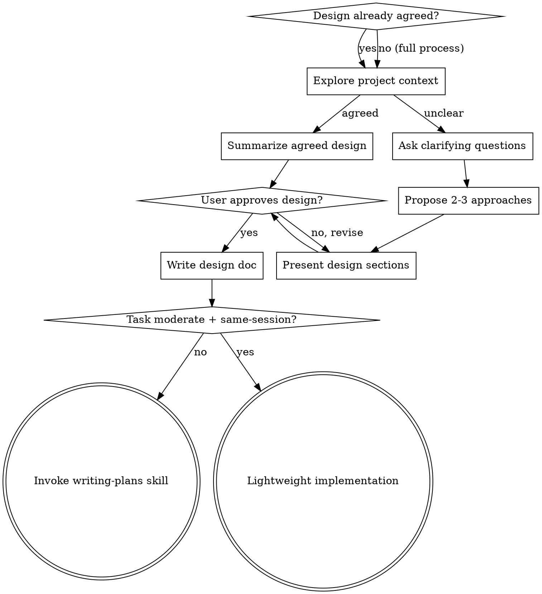

# Brainstorming Ideas Into Designs

## Overview

Help turn ideas into fully formed designs and specs through natural collaborative dialogue.

Start by understanding the current project context, then ask questions one at a time to refine the idea. Once you understand what you're building, present the design and get user approval.

<HARD-GATE>
Do NOT invoke any implementation skill, write any code, scaffold any project, or take any implementation action until you have a design and the user has approved it.
</HARD-GATE>

## Choosing the Right Path

Three paths, scaled to the situation:

| Path | When | Steps | Exit to |
|------|------|-------|---------|
| **Full process** | Requirements unclear, multiple approaches | Q&A → approaches → design → doc | writing-plans |
| **Fast path** | Design agreed, but task is large or multi-session | Summarize → confirm → doc | writing-plans |
| **Lightweight** | Design agreed AND task is moderate (< ~300 lines new code, same-session) | Summarize → confirm → doc with acceptance criteria | dispatch implementer directly |

**How to tell the difference:**
- **Full process:** Requirements are vague, multiple valid approaches exist, you have real questions about scope/constraints/tradeoffs
- **Fast path:** Design is agreed but the task is large enough to benefit from a formal plan (multi-task, multi-session, or complex enough that an implementer needs detailed guidance)
- **Lightweight:** Design is agreed, task is moderate, execution is same-session. A formal plan would just restate the design. Go straight to implementation + code quality review.

The anti-rationalization check: can you articulate the agreed design in concrete terms (components, data flow, key decisions)? If yes, fast path or lightweight. If you're hand-waving with "it's basically just X," you need the full process. The choice between fast path and lightweight depends on task size and complexity, not on how well you understand it.

## Anti-Pattern: "This Is Too Simple To Need A Design"

Every project goes through this process. A todo list, a single-function utility, a config change — all of them. "Simple" projects are where unexamined assumptions cause the most wasted work. The design can be short (a few sentences for truly simple projects), but you MUST present it and get approval. Note: the fast path above still produces a design — it just doesn't force re-discovery of things already agreed.

## Checklist

**Lightweight** (design agreed, moderate task, same-session):
1. **Explore project context** — use `julie:get_context` to orient, check recent commits
2. **Summarize agreed design with acceptance criteria** — present for user confirmation
3. **Write design doc** — save to `docs/plans/YYYY-MM-DD-<topic>-design.md` and commit. Include acceptance criteria checklist — this is the implementer's spec.
4. **Dispatch implementer directly** — see "Lightweight Implementation" section below

**Fast path** (design agreed, large or multi-session task):
1. **Explore project context** — use `julie:get_context` to orient, check recent commits
2. **Summarize agreed design** — present concrete summary for user confirmation
3. **Write design doc** — save to `docs/plans/YYYY-MM-DD-<topic>-design.md` and commit
4. **Transition to implementation** — invoke writing-plans skill

**Full process** (requirements unclear or multiple approaches):
1. **Explore project context** — use `julie:get_context` to orient on the relevant codebase area, check recent commits
2. **Ask clarifying questions** — one at a time, understand purpose/constraints/success criteria
3. **Propose 2-3 approaches** — with trade-offs and your recommendation
4. **Present design** — in sections scaled to their complexity, get user approval after each section
5. **Write design doc** — save to `docs/plans/YYYY-MM-DD-<topic>-design.md` and commit
6. **Transition to implementation** — invoke writing-plans skill to create implementation plan

## Process Flow



**Terminal states:** Either invoke writing-plans (full/fast path) or proceed to lightweight implementation (see below). These are the only two exits from brainstorming.

## The Process

**Understanding the idea:**
- Orient with Julie tools first: `get_context(query='<feature area>')` for token-budgeted codebase context, `get_symbols(file_path)` to understand file structure, `deep_dive(symbol)` for key symbols you'll be discussing. Do NOT fall back to Glob → Read → Grep chains.
- Check recent commits: `git log --oneline -10`
- Ask questions one at a time to refine the idea
- Prefer multiple choice questions when possible, but open-ended is fine too
- Only one question per message - if a topic needs more exploration, break it into multiple questions
- Focus on understanding: purpose, constraints, success criteria

**Exploring approaches:**
- Propose 2-3 different approaches with trade-offs
- Present options conversationally with your recommendation and reasoning
- Lead with your recommended option and explain why

**Presenting the design:**
- Once you believe you understand what you're building, present the design
- Scale each section to its complexity: a few sentences if straightforward, up to 200-300 words if nuanced
- Ask after each section whether it looks right so far
- Cover: architecture, components, data flow, error handling, testing
- Be ready to go back and clarify if something doesn't make sense

## After the Design

**Documentation (all paths):**
- Write the validated design to `docs/plans/YYYY-MM-DD-<topic>-design.md`
- Commit the design document to git

**Full/fast path → writing-plans:**
- Invoke the writing-plans skill to create an implementation plan

**Lightweight → direct implementation:**
- See "Lightweight Implementation" below

## Lightweight Implementation

For moderate, well-understood tasks executed in the same session. Skips writing-plans and subagent-driven-development — dispatches implementer and reviewer directly.

**The design doc IS the plan.** Make sure it includes:
- What to build and why
- Which files to create/modify (exact paths from Julie tools)
- Acceptance criteria checklist
- Key decisions and edge cases

**Step 1: Dispatch implementer subagent**

Use the implementer-prompt.md template from subagent-driven-development. The "Task Description" is the design doc content. The "Context" is the conversational background.

```
Agent tool (general-purpose):
  description: "Implement [feature name]"
  prompt: |
    [Follow implementer-prompt.md template]
    Task description = the design doc
    Context = conversational agreement
```

Save the returned **agent ID** — you'll need it if the reviewer finds issues.

**Step 2: Code quality review**

After the implementer reports back, dispatch a code quality reviewer using the code-quality-reviewer-prompt.md template from subagent-driven-development.

**Step 3: Fix if needed**

If the reviewer finds issues, **resume** the implementer (Agent tool `resume` parameter) with the reviewer's findings. Don't dispatch a fresh subagent. See fix-prompt.md in subagent-driven-development.

**Step 4: Done**

After review passes, use razorback:finishing-a-development-branch.

## Key Principles

- **One question at a time** - Don't overwhelm with multiple questions
- **Multiple choice preferred** - Easier to answer than open-ended when possible
- **YAGNI ruthlessly** - Remove unnecessary features from all designs
- **Explore alternatives** - Always propose 2-3 approaches before settling
- **Incremental validation** - Present design, get approval before moving on
- **Be flexible** - Go back and clarify when something doesn't make sense
