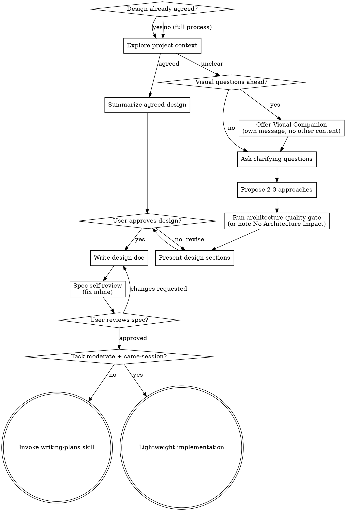

# Brainstorming Ideas Into Designs

## Overview

Help turn ideas into fully formed designs and specs through natural collaborative dialogue.

Start by understanding the current project context, then ask questions one at a time to refine the idea. Once you understand what you're building, present the design and get user approval.

<HARD-GATE>
Do NOT invoke any implementation skill, write any code, scaffold any project, or take any implementation action until you have a design and the user has approved it.
</HARD-GATE>

## Choosing the Right Path

Three paths, scaled to the situation:

| Path | When | Steps | Exit to |
|------|------|-------|---------|
| **Full process** | Requirements unclear, multiple approaches | Q&A → approaches → design → doc | writing-plans |
| **Fast path** | Design agreed, but task is large or multi-session | Summarize → confirm → doc | writing-plans |
| **Lightweight** | Design agreed AND task is moderate (< ~300 lines new code, same-session) | Summarize → confirm → doc with acceptance criteria | dispatch implementer directly |

**How to tell the difference:**
- **Full process:** Requirements are vague, multiple valid approaches exist, you have real questions about scope/constraints/tradeoffs
- **Fast path:** Design is agreed but the task is large enough to benefit from a formal plan (multi-task, multi-session, or complex enough that an implementer needs detailed guidance)
- **Lightweight:** Design is agreed, task is moderate, execution is same-session. A formal plan would just restate the design. Go straight to implementation + code quality review.

The anti-rationalization check: can you articulate the agreed design in concrete terms (components, data flow, key decisions)? If yes, fast path or lightweight. If you're hand-waving with "it's basically just X," you need the full process. The choice between fast path and lightweight depends on task size and complexity, not on how well you understand it.

## Anti-Pattern: "This Is Too Simple To Need A Design"

Every project goes through this process. A todo list, a single-function utility, a config change: all of them. "Simple" projects are where unexamined assumptions cause the most wasted work. The design can be short for truly simple projects, but you MUST present it and get approval. Note: the fast path above still produces a design; it just doesn't force re-discovery of things already agreed.

## Checklist

**Lightweight** (design agreed, moderate task, same-session):
1. **Explore project context** — use `julie:get_context` to orient, check recent commits
2. **Summarize agreed design with acceptance criteria** - present for user confirmation
3. **Write design doc** - save to `docs/plans/YYYY-MM-DD-<topic>-design.md` and commit. Include acceptance criteria checklist; this is the implementer's spec.
4. **Spec self-review** - quick inline check for placeholders, contradictions, ambiguity, scope (see below)
5. **User reviews written spec** - ask user to review the spec file before proceeding
6. **Dispatch implementer directly** - see "Lightweight Implementation" section below

**Fast path** (design agreed, large or multi-session task):
1. **Explore project context** — use `julie:get_context` to orient, check recent commits
2. **Summarize agreed design** - present concrete summary for user confirmation
3. **Write design doc** - save to `docs/plans/YYYY-MM-DD-<topic>-design.md` and commit
4. **Spec self-review** - quick inline check for placeholders, contradictions, ambiguity, scope (see below)
5. **User reviews written spec** - ask user to review the spec file before proceeding
6. **Transition to implementation** - invoke writing-plans skill

**Full process** (requirements unclear or multiple approaches):
1. **Explore project context** — use `julie:get_context` to orient on the relevant codebase area, check recent commits
2. **Offer visual companion** (if topic will involve visual questions) - this is its own message, not combined with a clarifying question. See the Visual Companion section below.
3. **Ask clarifying questions** - one at a time, understand purpose/constraints/success criteria
4. **Propose 2-3 approaches** - with trade-offs and your recommendation
5. **Run `razorback:architecture-quality`** - for non-trivial work, capture the approved module/interface shape before presenting the design. If the task has no architecture impact, note `No Architecture Impact`.
6. **Present design** - in sections scaled to their complexity, get user approval after each section
7. **Write design doc** - save to `docs/plans/YYYY-MM-DD-<topic>-design.md` and commit
8. **Spec self-review** - quick inline check for placeholders, contradictions, ambiguity, scope (see below)
9. **User reviews written spec** - ask user to review the spec file before proceeding
10. **Transition to implementation** - invoke writing-plans skill to create implementation plan

## Process Flow



**Terminal states:** Either invoke writing-plans (full/fast path) or proceed to lightweight implementation (see below). These are the only two exits from brainstorming.

## The Process

**Understanding the idea:**
- Orient with Julie tools first: `get_context(query='<feature area>')` for token-budgeted codebase context, `get_symbols(file_path)` to understand file structure, `deep_dive(symbol)` for key symbols you'll be discussing. Do NOT fall back to Glob → Read → Grep chains.
- For non-trivial work, run `razorback:architecture-quality` after Julie orientation and once requirements are clear enough to assess structure, before presenting the design. If the task has no architecture impact, record `No Architecture Impact` and continue.
- Check recent commits: `git log --oneline -10`
- Ask questions one at a time to refine the idea
- Prefer multiple choice questions when possible, but open-ended is fine too
- Only one question per message - if a topic needs more exploration, break it into multiple questions
- Focus on understanding: purpose, constraints, success criteria

**Exploring approaches:**
- Propose 2-3 different approaches with trade-offs
- Present options conversationally with your recommendation and reasoning
- Lead with your recommended option and explain why

**Presenting the design:**
- Once you believe you understand what you're building, present the design
- Scale each section to its complexity: a few sentences if straightforward, up to 200-300 words if nuanced
- Ask after each section whether it looks right so far
- Cover: architecture, components, data flow, error handling, testing
- Be ready to go back and clarify if something doesn't make sense

## After the Design

**Documentation (all paths):**
- Write the validated design to `docs/plans/YYYY-MM-DD-<topic>-design.md`
- Commit the design document to git

**Spec Self-Review:**
After writing the spec document, look at it with fresh eyes:

1. **Placeholder scan:** Any "TBD", "TODO", incomplete sections, or vague requirements? Fix them.
2. **Internal consistency:** Do any sections contradict each other? Does the architecture match the feature descriptions?
3. **Scope check:** Is this focused enough for a single implementation plan, or does it need decomposition?
4. **Ambiguity check:** Could any requirement be interpreted two different ways? If so, pick one and make it explicit.

Fix any issues inline. No need to re-review, just fix and move on.

**User Review Gate:**
After the spec review loop passes, ask the user to review the written spec before proceeding:

> "Spec written and committed to `<path>`. Please review it and let me know if you want to make any changes before we start writing out the implementation plan."

Wait for the user's response. If they request changes, make them and re-run the spec review loop. Only proceed once the user approves.

**Full/fast path → writing-plans:**
- Invoke the writing-plans skill to create an implementation plan

**Lightweight → direct implementation:**
- See "Lightweight Implementation" below

## Lightweight Implementation

For moderate, well-understood tasks executed in the same session. Skips writing-plans — dispatches directly to implementation.

**The design doc IS the plan.** Make sure it includes:
- What to build and why
- Which files to create/modify (exact paths from Julie tools)
- Acceptance criteria checklist
- Key decisions and edge cases

**If the task has 2+ independent parts:** Use `razorback:subagent-driven-development`. The design doc serves as the plan. Dispatch one implementer subagent per independent part in parallel, assigning file ownership to prevent conflicts.

**If the task is a single coherent unit:** Dispatch one implementer using the prompt template from `razorback:subagent-driven-development`.

```
Agent / Task tool:
  description: "Implement [feature name]"
  prompt: |
    [Follow subagent-driven-development/implementer-prompt.md template]
    Task description = the design doc
    Context = conversational agreement
```

**Review:** Lead does inline review when the implementer reports back (spec compliance + code quality). If issues found, route the fix per `razorback:subagent-driven-development` (resume on Claude Code, fresh dispatch with fix context on opencode).

**Done:** After review passes, use razorback:finishing-a-development-branch.

## Visual Companion

A browser-based companion for showing mockups, diagrams, and visual options during brainstorming. Available as a tool, not a mode. Accepting the companion means it's available for questions that benefit from visual treatment; it does NOT mean every question goes through the browser.

**Offering the companion:** When you anticipate that upcoming questions will involve visual content (mockups, layouts, diagrams), offer it once for consent:
> "Some of what we're working on might be easier to explain if I can show it to you in a web browser. I can put together mockups, diagrams, comparisons, and other visuals as we go. This feature is still new and can be token-intensive. Want to try it? (Requires opening a local URL)"

**This offer MUST be its own message.** Do not combine it with clarifying questions, context summaries, or any other content. The message should contain ONLY the offer above and nothing else. Wait for the user's response before continuing. If they decline, proceed with text-only brainstorming.

**Per-question decision:** Even after the user accepts, decide FOR EACH QUESTION whether to use the browser or the terminal. The test: **would the user understand this better by seeing it than reading it?**

- **Use the browser** for content that IS visual (mockups, wireframes, layout comparisons, architecture diagrams, side-by-side visual designs)
- **Use the terminal** for content that is text (requirements questions, conceptual choices, tradeoff lists, A/B/C/D text options, scope decisions)

If they agree to the companion, read the detailed guide before proceeding:
`skills/brainstorming/visual-companion.md`

## Key Principles

- **One question at a time** - Don't overwhelm with multiple questions
- **Multiple choice preferred** - Easier to answer than open-ended when possible
- **YAGNI ruthlessly** - Remove unnecessary features from all designs
- **Explore alternatives** - Always propose 2-3 approaches before settling
- **Incremental validation** - Present design, get approval before moving on
- **Be flexible** - Go back and clarify when something doesn't make sense
