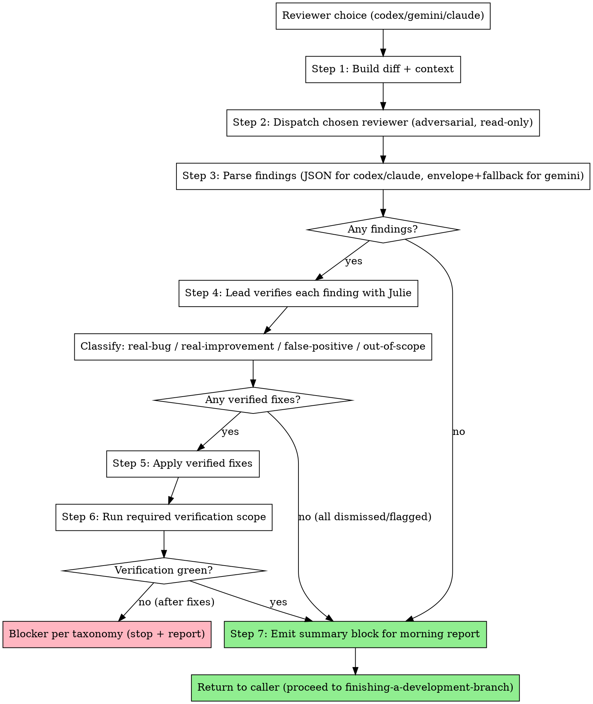

# Pre-Merge External Review

## Overview

Run a fresh, isolated external reviewer (codex / gemini / claude) against the full branch diff after all tasks are done and the plan's branch-gate verification scope is green, then route verified findings through razorback's own fix flow. The lead verifies every finding against the code with Julie, classifies it (real-bug / real-improvement / false-positive / out-of-scope), fixes what's real, dismisses what isn't (with a written reason), and flags what needs human judgment. Single pass, no round-two review after fixes. The output is a summary block that slots into the morning report's External review section, so the user sees exactly what the reviewer said, what the lead did with it, and why.

## When to invoke

Invoked by:

- `executing-plans` Step 3 (between task execution and `finishing-a-development-branch`)
- `subagent-driven-development` Step 4a (same position in that flow)

Skip this skill entirely if the reviewer choice is `none`. The choice is fixed by `writing-plans` during execution handoff and does not change mid-run.

**Pre-conditions:**

- All plan tasks are complete
- The verification ledger has a passing `branch-gate` entry for current HEAD, or the caller can run that scope before review
- The branch is NOT yet pushed (no PR yet)
- A reviewer was chosen: one of `codex`, `gemini`, `claude`
- The plan's model routing identifies the strategy/escalation tier for external review and fix workers

If any pre-condition is not met, abort and surface the gap to the caller. Do not review a partial branch or pre-push a branch on your own.

## The Process



## Step 1: Build diff + context

The reviewer needs the full picture of what shipped, not the latest commit only. Build the diff from the merge base of the branch against the base branch (typically `main` or `master`).

```bash
# Detect base branch (prefer main, fall back to master)
BASE=$(git merge-base HEAD main 2>/dev/null || git merge-base HEAD master 2>/dev/null)
BRANCH=$(git rev-parse --abbrev-ref HEAD)
PROJECT_DIR=$(git rev-parse --show-toplevel)

# Full diff (what the reviewer reads)
DIFF=$(git diff "$BASE"..HEAD --no-ext-diff)

# File summary (stat + per-file line counts)
FILE_STAT=$(git diff --stat "$BASE"..HEAD)

# Commit messages on this branch (intent of each change)
COMMIT_LOG=$(git log --oneline "$BASE"..HEAD)

# Plan path (so the reviewer can cross-check scope)
PLAN_PATH="docs/plans/<YYYY-MM-DD>-<feature>.md"   # filled from the in-session plan
```

Pass all four to the chosen reviewer: `$DIFF`, `$FILE_STAT`, `$COMMIT_LOG`, `$PLAN_PATH`. The reviewer prompts at `reviewer-prompts/*.md` document how to wire them into each CLI's invocation.

Optional: if the plan carried a focus area ("focus on the auth boundary", "pay attention to schema migrations"), include it in the prompt. Do not invent a focus the user did not ask for.

Apply the plan's Model Routing section when invoking the external reviewer if the reviewer CLI supports model selection. External review should use the strategy or escalation tier, never a mechanical or implementation tier.

Gate-interpretation review is a separate lane from pre-merge review. When the
question is "is this failing test, replay, or metric wrong, or is the
implementation wrong?", use the plan's gate-review or escalation route before
claiming verification evidence. Do not route that decision to a mechanical
worker.

## Step 2: Dispatch the chosen reviewer

Select the prompt file based on the reviewer choice and invoke the matching reviewer-cli skill. Each file contains a complete runnable invocation. All three invocations run the reviewer in adversarial mode with read-only tool access — the reviewer never edits code.

- **codex** → follow [`reviewer-prompts/codex.md`](reviewer-prompts/codex.md). Calls `codex exec --ephemeral --color never --output-schema …` with the shared JSON schema. Background on codex's adversarial-review mode lives in the bundled `razorback:codex-cli` skill.
- **gemini** → follow [`reviewer-prompts/gemini.md`](reviewer-prompts/gemini.md). Calls `gemini -o json -m gemini-3-pro --yolo` with the schema inlined in the prompt body (gemini has no `--json-schema` flag). The reviewer-prompts file is self-contained — the adversarial template, schema, and placeholder-substitution logic are all inlined there. The bundled `razorback:gemini-cli` skill covers general gemini usage but does not have a separate adversarial-review section.
- **claude** → follow [`reviewer-prompts/claude.md`](reviewer-prompts/claude.md). Calls `claude -p --no-session-persistence --dangerously-skip-permissions --output-format json --json-schema … --tools "Read,Bash" --max-turns 15 --max-budget-usd 5.00 --model opus --system-prompt-file …`. The reviewer-prompts file is self-contained (schema + adversarial system prompt are inlined); `razorback:claude-cli` has the background treatment.

All three target the shared output schema defined canonically at `skills/codex-cli/schemas/review-output.schema.json` in the razorback plugin (verdict, summary, findings[severity, title, body, file, line_start, line_end, confidence, recommendation], next_steps). The reviewer-prompts files inline the schema content so invocations need no install-path knowledge.

## Step 3: Parse findings

Two paths, because gemini's output shape differs from codex's and claude's.

**codex / claude (strict schema):** the CLI enforces the JSON schema directly. Parse the stdout with `jq` against the same schema file and iterate `.findings[]`. No envelope.

```bash
jq -e '.findings[]' < reviewer-output.json     # fail non-zero if any finding is malformed
```

**gemini (envelope + markdown fallback):** gemini's `-o json` wraps the model response in a metadata envelope: `{session_id, response, stats: {models: {…: {tokens: …}}}}`. The `.response` field is plain text, frequently fenced in markdown (```` ```json … ``` ````). Execute the 5-step parsing protocol in `reviewer-prompts/gemini.md`:

1. `jq -r '.response'` to extract the model text from the envelope.
2. Strip markdown code fences.
3. `jq empty` to confirm the cleaned text is parseable JSON.
4. Validate against the shared schema. If invalid, retry once with a stricter "return ONLY JSON, no prose, no fences" prompt. If still invalid, fall back to the structured-markdown regex parser (`## Finding N` blocks).
5. Normalize every finding to the shared finding shape (the one in `review-output.schema.json`): `{severity, title, body, file, line_start, line_end, confidence, recommendation}`.

After Step 3, all three reviewer paths produce the same in-memory list of normalized findings. Log `stats.models.*.tokens` from the gemini envelope into the morning report's per-reviewer section for cost tracking; codex and claude do not surface per-request token counts in their JSON output, so note the asymmetry in the report.

## Step 4: Verify findings

For every finding, the lead checks the actual code before deciding what to do. Reviewers emit noise; rubber-stamping is banned. The full classification protocol lives in [`verification-protocol.md`](verification-protocol.md) — read it for the concrete examples.

Summary of the four classifications:

- **real-bug** — the code actually has the defect described. Fix is mandatory.
- **real-improvement** — not a bug, but a legitimate quality improvement (naming, coupling, missed edge case that matters). Fix is recommended unless it expands scope beyond the plan.
- **false-positive** — reviewer misread the code, invented a path, or flagged an intentional pattern. Dismiss with a written reason.
- **out-of-scope** — real finding, outside the plan's scope. Dismiss with "out of scope, filed as follow-up" (or equivalent specific reason).

Verification always uses Julie:

- `julie:deep_dive(symbol=<referenced symbol>)` — check the symbol's callers, callees, types.
- `julie:fast_refs(symbol=<referenced symbol>)` — check the full impact if the finding touches a public API.
- `julie:get_symbols(file_path=<file>)` — see the file structure without reading the whole file.

Dismissal rule: no finding is dismissed without a written reason that ends up in the morning report. The user will read those reasons on PR review and can override any of them.

Flagging rule: if a finding is real AND the lead cannot determine the right fix without human input (architectural question, priority trade-off, security-boundary call), do **not** fix. Flag it in the morning report's "Flagged for your review" block with a short "why uncertain" note.

## Step 5: Apply verified fixes

Every fix path stays Julie-first. Whoever applies the fix, the lead or a delegated worker, orients with Julie before touching code.

**When delegation is available:** dispatch a fresh implementer worker per finding, or **group by file if multiple findings cluster on the same file**. Use the template at [`fix-dispatch-prompt.md`](fix-dispatch-prompt.md). File ownership and model tier must be stated so parallel fixers do not collide or run below the finding's risk level. If findings span disjoint files, you can dispatch in parallel. If they cluster on the same file, either serialize the fixes or batch them into one worker dispatch.

**When delegation is unavailable (e.g., a no-delegation `executing-plans` run, or the lead is itself running as a subagent — Gemini blocks recursion):** the lead applies the verified fixes inline in the current session. Work one finding at a time, or batch same-file findings only. Use the scope boundary and Julie-first checklist in [`fix-dispatch-prompt.md`](fix-dispatch-prompt.md) as the inline checklist. Do not invent a subagent path that the harness cannot run.

Why fresh workers when delegation exists? The review runs after the main execution phase has ended and worker context may be closed or stale. Fresh workers work at any point in the timeline, and they come with no implementation-phase bias that might rationalize around a finding.

## Step 6: Run required verification

After all delegated fix workers report DONE and commit their changes, or after the inline fixes are committed on a no-delegation run, run the smallest project-defined verification scope that covers the fixes. If the fixes change branch-level behavior or invalidate the prior branch-gate ledger entry, run the branch-gate scope again. If the same HEAD already has a passing ledger entry for the required scope, reuse that evidence.

If verification fails after fixes:

1. If the failure is a straightforward issue introduced by the fix and the implementer missed it, apply one more focused fix round with the failure context. Dispatch a fresh fix worker when delegation exists, or fix inline on a no-delegation run. One retry, not a loop.
2. If the retry fails or the failure looks structural, this is **blocker taxonomy #5** (unresolvable test failures) — see `skills/using-razorback/references/blocker-taxonomy.md`. Stop and write the blocker into the morning report. Do not push a red branch.

If verification passes, proceed to Step 7.

## Step 7: Emit summary for morning report

Produce a structured block that slots into the External review section of `skills/finishing-a-development-branch/morning-report-template.md`. The template's External review section already defines these placeholders — fill them:

- `{{reviewer}}` — one of `codex`, `gemini`, `claude`.
- `{{findings_total}}` — count of findings returned by the reviewer (before classification).
- `{{findings_fixed_count}}` — count of verified findings that were fixed.
- `{{fix_commit_shas}}` — comma-separated short SHAs of the fix commits.
  - Per-fixed-finding sub-block: short title + short summary of the fix.
- `{{findings_dismissed_count}}` — count of dismissed findings (false-positive or out-of-scope).
  - Per-dismissed-finding sub-block: short title + **dismissal reason** (required, no silent dismissals).
- `{{findings_flagged_count}}` — count of real findings left for human judgment.
  - Per-flagged-finding sub-block: short title + **why uncertain** (required).

If the reviewer was gemini, also capture `stats.models.*.tokens` from the envelope and append a one-line cost note ("gemini used N prompt / M completion tokens"). Codex and claude do not surface per-request token counts — note the absence rather than faking a number.

The caller (`executing-plans` Step 3 or `subagent-driven-development` Step 4a) takes this block and hands it forward to `finishing-a-development-branch`, which renders it into the PR description (summary form) and the full worktree report.

## Red flags

**Never:**

- **Loop external review.** Single pass only. No "review, fix, re-review" cycle. Leftover real findings that the lead cannot fix get flagged for human judgment and the PR proceeds.
- **Let the reviewer edit code.** Reviewers are read-only: codex and claude pin `--tools "Read,Bash"`; gemini uses `--yolo` only to auto-approve its own Read calls and is instructed by prompt to be read-only. Delegated fixes route through fresh implementer workers, and no-delegation runs fix inline under the same Julie-first checklist.
- **Silently dismiss findings.** Every dismissal requires a written reason in the morning report so the user can override on PR review. Silent dismissals defeat the whole point of running an external reviewer.
- **Skip verification after fixes.** Every fix invalidates prior affected scopes. Run the required project-defined verification scope, or reuse a ledger entry only when it covers the current HEAD and required scope. Never push a branch whose most recent verification does not include the fix commits.
- **Ship a PR without the reviewer the user requested.** Reviewer unavailability (auth, rate limit, budget/turn cap with no usable partial output, empty stdout, schema violation persisting after one retry) is a **blocker**, not a silent downgrade. Stop the run, do NOT push, do NOT create a PR, emit a partial morning report with `Status: Blocked` and the specific failure in `Blockers hit`, and exit. The user chose this reviewer for the run; quietly skipping the review turns an explicit request into an implicit "never mind".

## Integration

**Called by:**

- `executing-plans` — at Step 3, between task execution and `finishing-a-development-branch`
- `subagent-driven-development` — at Step 4a, same position

**Calls:**

- `codex-cli` skill (when reviewer = codex) — see `reviewer-prompts/codex.md`
- `gemini-cli` skill (when reviewer = gemini) — see `reviewer-prompts/gemini.md`
- `claude-cli` skill (when reviewer = claude) — see `reviewer-prompts/claude.md`

**References:**

- `skills/using-razorback/references/blocker-taxonomy.md` — stop-versus-proceed rules
- `skills/finishing-a-development-branch/morning-report-template.md` — shape of the summary block emitted in Step 7
- `skills/codex-cli/schemas/review-output.schema.json` (in the razorback plugin) — the shared finding shape all three reviewers target
