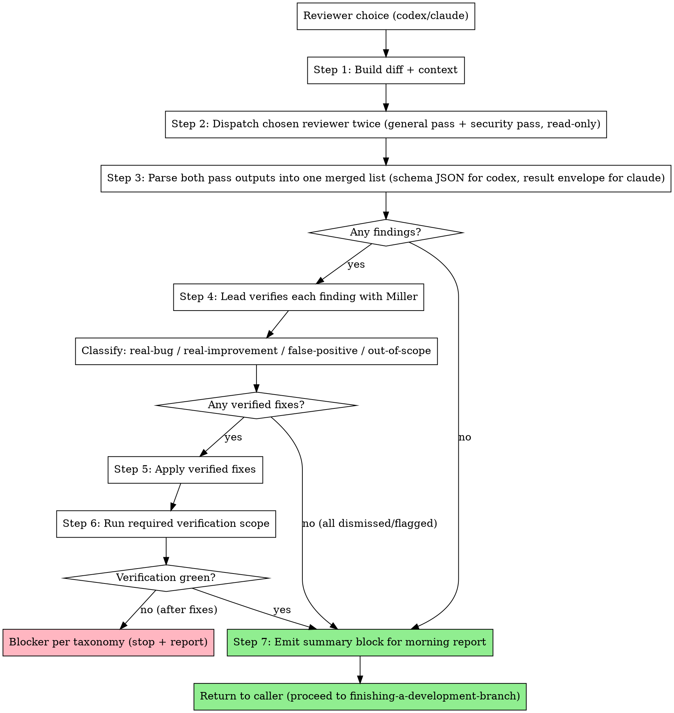

# Pre-Merge External Review

## Overview

Run a fresh, isolated external reviewer (codex / claude) against the full branch diff after all tasks are done and the plan's branch-gate verification scope is green, then route verified findings through razorback's own fix flow. The review is two passes of the same reviewer CLI, both against the full branch diff: a **general adversarial pass**, then a **dedicated security pass** driven by a security-only prompt. The lead verifies every finding against the code with Miller, classifies it (real-bug / real-improvement / false-positive / out-of-scope), fixes what's real, dismisses what isn't (with a written reason), and flags what needs human judgment. Each pass runs once — fixes receive local confirmation without a post-fix external re-review. The output is a summary block that slots into the morning report's External review section, so the user sees exactly what the reviewer said, what the lead did with it, and why.

**REQUIRED SUB-SKILL:** razorback:managing-review-campaigns.

## When to invoke

Invoked by:

- `executing-plans` Step 3 (between task execution and `finishing-a-development-branch`)
- `subagent-driven-development` Step 4a (same position in that flow)

Skip this skill entirely if the reviewer choice is `none`. The choice is fixed by `writing-plans` during execution handoff and does not change mid-run.

**Pre-conditions:**

- All plan tasks are complete
- The verification ledger has a passing `branch-gate` entry for current HEAD, or the caller can run that scope before review
- The branch is NOT yet pushed (no PR yet)
- A reviewer was chosen: one of `codex`, `claude`
- The external-model policy check in razorback:security-review passes. When a policy block exists, the chosen reviewer's provider (`codex` → `openai`, `claude` → `anthropic`) is allowed and the reviewer appears in `Reviewer choices permitted:`. When no external-model policy block exists, proceed and add the required loud morning-report note.

If any pre-condition is not met, abort and surface the gap to the caller. Do not review a partial branch or pre-push a branch on your own.

## Campaign Setup

After the pre-conditions and policy gate pass, emit this immutable setup before either external call:

```text
REVIEW CAMPAIGN
scope: full branch diff against merge base
workflow: pre-merge
participants: lead, <chosen reviewer>
required_reviewers: <chosen reviewer>
evidence_target: external-reviewed
severity_floor: medium
discovery_scopes: general, security
external_invocation_budget: 2
max_rounds: 2
round: 0/2
external_invocations: 0/2
```

The general and security calls consume the entire immutable external budget. The participant and reviewer cannot be replaced mid-campaign. A dispatch consumes its invocation even if output is unusable; the required reviewer being unavailable or failing either pass closes the campaign `blocked`.

## The Process



## Step 1: Build diff + context

The reviewer needs the full picture of what shipped, not the latest commit only. Build the diff from the merge base of the branch against the base branch (typically `main` or `master`).

```bash
# Detect base branch (prefer main, fall back to master)
BASE=$(git merge-base HEAD main 2>/dev/null || git merge-base HEAD master 2>/dev/null)
BRANCH=$(git rev-parse --abbrev-ref HEAD)
PROJECT_DIR=$(git rev-parse --show-toplevel)

# Full diff (what the reviewer reads)
DIFF=$(git diff "$BASE"..HEAD --no-ext-diff)

# File summary (stat + per-file line counts)
FILE_STAT=$(git diff --stat "$BASE"..HEAD)

# Commit messages on this branch (intent of each change)
COMMIT_LOG=$(git log --oneline "$BASE"..HEAD)

# Plan path (so the reviewer can cross-check scope)
PLAN_PATH="docs/plans/<YYYY-MM-DD>-<feature>.md"   # filled from the in-session plan
```

Pass all four to the chosen reviewer: `$DIFF`, `$FILE_STAT`, `$COMMIT_LOG`, `$PLAN_PATH`. The reviewer prompts at `reviewer-prompts/*.md` document how to wire them into each CLI's invocation.

Optional: if the plan carried a focus area ("focus on the auth boundary", "pay attention to schema migrations"), include it in the prompt. Do not invent a focus the user did not ask for.

Use the chosen reviewer CLI's default model unless the user, environment, or
lead explicitly selects another model for this run.

Gate-interpretation review is a separate lane from pre-merge review. When the
question is "is this failing test, replay, or metric wrong, or is the
implementation wrong?", treat that as lead-owned review evidence before claiming
verification evidence.

## Step 2: Dispatch the chosen reviewer

Before the diff is sent, re-read the policy and apply the external-model policy check in razorback:security-review at dispatch time. When a policy block exists, the dispatched CLI's provider (`codex` → `openai`, `claude` → `anthropic`) must be allowed and the reviewer must appear in `Reviewer choices permitted:`. A denial on either field means refuse this reviewer and name an allowed alternative. When no external-model policy block exists, proceed and add the required loud morning-report note. The policy gate applies per dispatch: re-read the policy immediately before each pass. Both passes use the same CLI, so both checks evaluate the same provider and reviewer — and a policy change between passes fails closed before the second dispatch. A denial follows the canonical procedure in razorback:security-review, including blocker taxonomy #4 on an autonomous run where the user chose this reviewer.

When a reviewer is chosen, dispatch the chosen CLI **twice** against the same diff and the same shared schema:

1. **General pass** — the existing adversarial prompt wiring in the chosen reviewer-prompts file below.
2. **Security pass** — the canonical security-only prompt at `../security-review/security-adversarial-prompt.txt` (in the razorback plugin), dispatched per the `## Security pass` section of the chosen reviewer-prompts file. Follow that section for the runnable invocation — do not construct the security-pass command here.

Immediately after the general pass call, record `external_invocations: 1/2`. Immediately after the security pass call, record `external_invocations: 2/2`. Count the calls even when parsing later fails. Do not dispatch either scope again.

Select the prompt file based on the reviewer choice and invoke the matching reviewer-cli skill. Each file contains a complete runnable invocation for each pass. Every invocation runs the reviewer in adversarial mode with read-only tool access — the reviewer never edits code.

- **codex** → follow [`reviewer-prompts/codex.md`](reviewer-prompts/codex.md). Calls `codex exec --ephemeral --color never --output-schema …` with the shared JSON schema. Background on codex's adversarial-review mode lives in the bundled `razorback:codex-cli` skill.
- **claude** → follow [`reviewer-prompts/claude.md`](reviewer-prompts/claude.md). Calls `claude -p --no-session-persistence --dangerously-skip-permissions --output-format json --json-schema … --tools "Read,Grep,Glob" --strict-mcp-config --system-prompt-file …` (no `--max-turns`, no `--max-budget-usd` — razorback caps neither the turns nor the spend of a review). The reviewer-prompts file reads the canonical schema and claude-cli's canonical adversarial prompt from the plugin at dispatch time; `razorback:claude-cli` has the background treatment.

Both target the shared output schema defined canonically at `../codex-cli/schemas/review-output.schema.json` in the razorback plugin (verdict, summary, findings[severity, title, body, file, line_start, line_end, confidence, recommendation], next_steps). Both reviewer-prompts files read the schema from that canonical file at dispatch time (claude strips the `$schema` key its validator rejects).

## Step 3: Parse findings

Two parse paths, because each CLI's output shape differs — and two outputs per review, because each pass writes its own output file. Both files live in `$OUT_DIR`, the private temp directory the reviewer-prompts invocation creates outside the worktree. Apply the chosen CLI's rules below to both pass outputs.

**codex (strict schema, no envelope):** `--output-schema` makes the CLI enforce the JSON schema directly on stdout. Validate the array shape, then iterate — a clean review has `findings: []`, and `jq -e '.findings[]'` exits 4 on a valid empty array, which would misread success as a parse failure.

```bash
jq -e '.findings | type == "array"' < "$OUT_DIR/codex-output.json" >/dev/null   # shape check
jq '.findings[]?' < "$OUT_DIR/codex-output.json"                                # iterate; empty = clean review
```

**claude (result envelope):** `--output-format json` wraps the response in a result envelope: `{type, subtype, result, structured_output, usage, total_cost_usd, …}`. With `--json-schema`, the parsed object lands in `.structured_output`; `.result` holds the same JSON as a string.

```bash
jq -e '.structured_output.findings | type == "array"' < "$OUT_DIR/claude-output.json" >/dev/null \
  || jq -re '.result' < "$OUT_DIR/claude-output.json" | jq -e '.findings | type == "array"' >/dev/null
jq '.structured_output.findings[]?' < "$OUT_DIR/claude-output.json"   # iterate; empty = clean review
```

After Step 3, both reviewer paths produce **one merged list** of normalized findings covering both passes. Tag each finding with the pass that produced it (`general` / `security`) — the tag carries into classification and the morning report. For cost tracking in the morning report's per-reviewer section: claude surfaces `.total_cost_usd` and `.usage.{input_tokens,output_tokens}` in each pass's envelope — sum the two invocations; codex does not surface per-request token counts in its JSON output, so note the absence for codex rather than faking a number.

Malformed or schema-invalid output is a failed required-reviewer pass. Close `blocked` with the consumed invocation count; do not retry and displace the other declared discovery scope.

## Step 4: Verify findings

For every finding, the lead checks the actual code before deciding what to do. Reviewers emit noise; rubber-stamping is banned. The full classification protocol lives in [`verification-protocol.md`](verification-protocol.md) — read it for the concrete examples.

Summary of the four classifications:

- **real-bug** — the code actually has the defect described. Fix is mandatory.
- **real-improvement** — not a bug, but a legitimate quality improvement (naming, coupling, missed edge case that matters). Fix is recommended unless it expands scope beyond the plan.
- **false-positive** — reviewer misread the code, invented a path, or flagged an intentional pattern. Dismiss with a written reason.
- **out-of-scope** — real finding, outside the plan's scope. Dismiss with "out of scope, filed as follow-up" (or equivalent specific reason).

Dedupe rule: when both passes flag the same defect (same file, same lines, same root issue), collapse them into one finding and note it as `dual-flagged`. Dual-flagging is a confidence signal for classification — two independent prompts saw the same problem — never double-counted work: classify once, fix once, count once.

Verification always uses Miller:

- **Inspect** the referenced symbol — check its callers, callees, types with `inspect(target, depth=overview)`; escalate to `depth=full` only for the symbol the finding centers on.
- **Find references** — check the full impact if the finding touches a public API with `trace`.
- **List the file's symbols** — see the file structure without reading the whole file with `inspect`.

Dismissal rule: no finding is dismissed without a written reason that ends up in the morning report. The user will read those reasons on PR review and can override any of them.

Flagging rule: if a finding is real AND the lead cannot determine the right fix without human input (architectural question, priority trade-off, security-boundary call), do **not** fix. Flag it in the morning report's "Flagged for your review" block with a short "why uncertain" note.

## Step 5: Apply verified fixes

Every fix path stays Miller-first. Whoever applies the fix, the lead or a delegated worker, orients with Miller before touching code.

**When delegation is available:** dispatch a fresh implementer worker per finding, or **group by file if multiple findings cluster on the same file**. Use the template at [`fix-dispatch-prompt.md`](fix-dispatch-prompt.md). File ownership must be stated so parallel fixers do not collide. If findings span disjoint files, you can dispatch in parallel. If they cluster on the same file, either serialize the fixes or batch them into one worker dispatch.

**When delegation is unavailable (e.g., a no-delegation `executing-plans` run, or the lead is itself running as a subagent on a harness that blocks recursion):** the lead applies the verified fixes inline in the current session. Work one finding at a time, or batch same-file findings only. Use the scope boundary and Miller-first checklist in [`fix-dispatch-prompt.md`](fix-dispatch-prompt.md) as the inline checklist. Do not invent a subagent path that the harness cannot run.

Why fresh workers when delegation exists? The review runs after the main execution phase has ended and worker context may be closed or stale. Fresh workers work at any point in the timeline, and they come with no implementation-phase bias that might rationalize around a finding.

## Step 6: Run required verification

After all delegated fix workers report DONE and commit their changes, or after the inline fixes are committed on a no-delegation run, begin Round 2 local confirmation. Run the smallest project-defined verification scope that covers the fixes and inspect only the fix diff for new breakage. If the fixes change branch-level behavior or invalidate the prior branch-gate ledger entry, run the branch-gate scope again. If the same HEAD already has a passing ledger entry for the required scope, reuse that evidence. No external reviewer is dispatched during local confirmation.

If verification fails after fixes:

1. If the failure is a straightforward issue introduced by the fix and the implementer missed it, apply one more focused fix round with the failure context. Dispatch a fresh fix worker when delegation exists, or fix inline on a no-delegation run. One retry, not a loop.
2. If the retry fails or the failure looks structural, this is **blocker taxonomy #5** (unresolvable test failures) — see `../using-razorback/references/blocker-taxonomy.md` (in the razorback plugin). Stop and write the blocker into the morning report. Do not push a red branch.

If verification passes, proceed to Step 7.

## Step 7: Emit summary for morning report

Produce a structured block that slots into the External review section of `../finishing-a-development-branch/morning-report-template.md`. The template's External review section already defines these placeholders — fill them:

- `{{reviewer}}` — one of `codex`, `claude`.
- `{{general_findings_count}}` / `{{security_findings_count}}` — per-pass counts of findings as each pass returned them, rendered on the template's **Passes** line (`general N / security M`).
- `{{findings_total}}` — combined count across both passes after the Step 4 dedupe (a `dual-flagged` finding counts once), before classification.
- `{{findings_fixed_count}}` — count of verified findings that were fixed.
- `{{fix_commit_shas}}` — comma-separated short SHAs of the fix commits.
  - Per-fixed-finding sub-block: short title + short summary of the fix.
- `{{findings_dismissed_count}}` — count of dismissed findings (false-positive or out-of-scope).
  - Per-dismissed-finding sub-block: short title + **dismissal reason** (required, no silent dismissals).
- `{{findings_flagged_count}}` — count of real findings left for human judgment.
  - Per-flagged-finding sub-block: short title + **why uncertain** (required).

Append a one-line cost note per reviewer, summed across both pass invocations: claude from `.total_cost_usd` and `.usage` ("claude used N in / M out tokens, $X.XX"). Codex does not surface per-request token counts — note the absence rather than faking a number.

Also emit the terminal campaign block consumed by the morning report. Use `clean` when nothing above the floor remains open, `capped` when the fixed budget or round limit is exhausted with non-blocking findings still open, and `blocked` when the required reviewer failed or an unresolved critical/high finding meets the blocker taxonomy:

```text
REVIEW CAMPAIGN STATUS
state: clean | capped | blocked
evidence: external-reviewed
round: <current>/2
external_invocations: <used>/2
open_critical_high: <count>
open_medium_low: <count>
open_above_floor: <count>
campaign_closed: yes
```

Every state with `campaign_closed: yes` is terminal. The caller must not dispatch another reviewer after this block.

The caller (`executing-plans` Step 3 or `subagent-driven-development` Step 4a) takes this block and hands it forward to `finishing-a-development-branch`, which renders it into the PR description (summary form) and the full worktree report.

## Red flags

**Never:**

- **Loop external review.** Each pass runs once. No "review, fix, re-review" cycle for the general pass or the security pass. Leftover real findings that the lead cannot fix get flagged for human judgment and the PR proceeds.
- **Re-run a reviewer that already burned a full attempt.** A run that consumed half an hour and a full context and returned nothing is not fixed by another attempt with a bigger timeout or a split diff. Every call consumes one of the two immutable invocations; malformed output blocks instead of authorizing a retry. A reviewer that runs long is working, not stuck.
- **Cap the reviewer to control cost.** The review's scope is set by the prompt, not by `--max-turns`, `--max-budget-usd`, or a shortened timeout. A cap truncates the review mid-flight, and a truncated review gets re-run in full. The 30-minute timeout is a failsafe for a hung process and nothing more.
- **Let the reviewer edit code.** Reviewers are read-only, each via its CLI's real mechanism: codex runs under `-s read-only` (sandbox blocks writes), claude pins `--tools "Read,Grep,Glob" --strict-mcp-config` (no write-capable tool in the set). Delegated fixes route through fresh implementer workers, and no-delegation runs fix inline under the same Miller-first checklist.
- **Silently dismiss findings.** Every dismissal requires a written reason in the morning report so the user can override on PR review. Silent dismissals defeat the whole point of running an external reviewer.
- **Skip verification after fixes.** Every fix invalidates prior affected scopes. Run the required project-defined verification scope, or reuse a ledger entry only when it covers the current HEAD and required scope. Never push a branch whose most recent verification does not include the fix commits.
- **Ship a PR without the reviewer the user requested.** Reviewer unavailability in **either pass** (auth, rate limit, timeout with no usable partial output, empty stdout, schema violation) is a **blocker**, not a silent downgrade — the same triggers and the same protocol apply to the general pass and the security pass. Skipping the security pass when a reviewer is chosen is this same red flag: half a review is a silent downgrade. Stop the run, do NOT push, do NOT create a PR, emit a partial morning report with `Status: Blocked` and the specific failure in `Blockers hit`, and exit. The user chose this reviewer for the run; quietly skipping the review — or one of its passes — turns an explicit request into an implicit "never mind".

## Integration

**Called by:**

- `executing-plans` — at Step 3, between task execution and `finishing-a-development-branch`
- `subagent-driven-development` — at Step 4a, same position

**Calls:**

- `managing-review-campaigns` skill — owns immutable setup, counters, and terminal status
- `codex-cli` skill (when reviewer = codex) — see `reviewer-prompts/codex.md`
- `claude-cli` skill (when reviewer = claude) — see `reviewer-prompts/claude.md`

**References:**

- `../using-razorback/references/blocker-taxonomy.md` (in the razorback plugin) — stop-versus-proceed rules
- `../finishing-a-development-branch/morning-report-template.md` — shape of the summary block emitted in Step 7
- `../codex-cli/schemas/review-output.schema.json` (in the razorback plugin) — the shared finding shape both reviewers target
