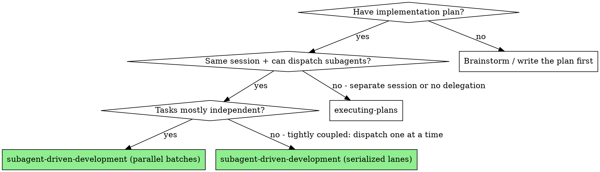

# Subagent-Driven Development

Execute a plan by dispatching fresh subagents per task, with the lead doing inline review (spec compliance + code quality) after each task. Independent tasks can be dispatched in parallel; tightly coupled tasks run sequentially. Commit mode decides whether the worker commits directly or hands the approved diff back to the lead.

**Core principle:** Fresh subagent per task + inline review by lead + parallel fan-out when tasks are independent = high quality without wasted ceremony.

**Dispatch mechanism:**
- **Claude Code:** `Agent` tool (one call per subagent; multiple calls in one turn run in parallel).
- **opencode:** `Task` tool (one call per subagent; multiple calls in one turn run in parallel). The built-in `general` subagent is suitable for most implementer work; `@mention` also works for manual invocation.
- **Codex:** `spawn_agent(task_name="task-N-<slug>", message=<filled prompt>)` (one call per subagent; multiple calls in one turn run in parallel). Keep the returned agent ID, `followup_task(target=<agent-id>, message=...)` feeds follow-ups (the closest thing to Claude Code's resume), and `wait_agent(timeout_ms=...)` blocks until agent completion. Surface verified on codex 0.144.3 — trust the live tool list over these names (see `../using-razorback/references/codex-tools.md`).
- **Explicit Cursor/Composer delegation from another harness:** use `razorback:cursor-agent`, which owns the Cursor CLI invocation. The current lead still owns planning, review, fix routing, and final verification; Cursor Agent is only the implementation worker.

Use the harness default model unless the user, environment, or lead explicitly
selects another model for this run. Razorback does not require a model table
before dispatch.

## When to Use



Fix-round follow-up mechanics are per-harness — see Step 4.

## Step 1: Extract Tasks from the Plan

Read the plan file once. Extract every task and its surrounding context. Create tracking tasks via `TaskCreate` so progress is visible.

Check for durable progress before dispatching. Resolve this plan's workspace, then read its ledger:

```bash
ws=$("$SKILL_DIR/scripts/sdd-workspace" PLAN_FILE)
cat "$ws/progress.md" 2>/dev/null || true
```

Trust the ledger only when its first line names this plan file (resume check: Durable Progress). A ledger that names a different plan — or a stray ledger at the old flat path — is another plan's: leave it in place and start fresh.

Tasks listed there as complete **with a named commit** are DONE. Do not re-dispatch them; verify the named commit with `git log` if needed, then resume at the first incomplete task.

Treat any completion line whose commit SHA is missing, `pending`, or absent from `git log` as **INCOMPLETE** — this is the `parallel-lead-commit` crash window. Run `git status`, inspect the working tree for that task's owned files, and either re-review and commit the approved edits (staging per the Commit Mode Contract) or re-dispatch the task. Never skip a task whose completion record has no verifiable commit.

Before dispatching, orient yourself on the codebase with Miller:
- **Orient** around the areas the plan touches with `context`
- **List a file's symbols** on files the plan will modify with `inspect`, so you can spot later drift during review
- Do NOT chain Glob/Grep/Read for orientation — Miller is the required entry point

Read `## Parallel Execution Contract` before dispatching and validate every task row:
- A safe batch with 2+ eligible tasks dispatches together when subagents are available.
- Safe means: non-overlapping file ownership, no ordering dependency, and `Serialization required: No`.
- Serialized lanes must record `Serialization required: Yes` plus a `Dependency reason` naming the real dependency or tool limitation.
- Serializing a safe batch requires a recorded dependency or tool limitation. Habit, caution, or "one at a time is easier" are not enough.

## Step 2: Dispatch Implementer Subagent

Use the template at `./implementer-prompt.md`.

**The brief file is the single source of task requirements** — this is the one statement of that rule; every other mention points here. The task text and every exact value (numbers, magic strings, signatures, test cases) are brief-resident: they appear only in `task-N-brief.md` (written by `task-brief`, File Handoffs), never in the spawn prompt. The spawn prompt introduces the brief path as "read this first — it is your requirements, with the exact values to use verbatim". Everything else the worker needs is prompt-resident, listed below.

**Record the base before dispatching:** `BASE=$(git rev-parse HEAD)`. Review packages and fix-round diffs are built from this recorded per-task BASE — never from `HEAD~1`, which silently drops all but the last commit of a multi-commit task.

The spawn prompt MUST include (all prompt-resident):

1. **Task brief path** with the read-this-first introduction above (don't paste the task text, don't make the subagent read the plan file)
2. **Scene-setting line** (how this task fits the larger plan)
3. **Earlier-task interfaces and decisions** this task consumes (execution-produced values the brief cannot contain — never accumulated prior-task summaries)
4. **The lead's ambiguity resolutions** for this task's requirements
5. **File ownership** (which files this task may modify)
6. **Miller directives** (orient, inspect before modifying any symbol, find references before changing public APIs, list a file's symbols before reading full files)
7. **TDD expectations** (from `razorback:test-driven-development`)
8. **Verification scope** specific to this task, using commands from the plan's verification strategy
9. **Commit mode** (`serial-worker-commit` or `parallel-lead-commit`)
10. **Miller evidence requirement** (the implementer must report which Miller calls they used and what those calls confirmed)
11. **API-shape evidence requirement** (the implementer must name the Miller evidence used for every symbol name, function signature, config shape, route name, CLI flag, or public contract they rely on)
12. **Gate invariant requirement** (the implementer must state what each assigned test, replay, metric, or acceptance gate proves)
13. **architecture-quality context** (the approved architecture, any `No Architecture Impact` note, and the plan mismatch rule)
14. **Report file path** under the plan's workspace (`.razorback/sdd/<plan-key>/`), so the worker writes the full report to a file and returns only status, commits, test summary, and concerns

### Verification Scope Contract

Razorback is language-agnostic. The target repo supplies concrete commands through its docs and the plan's Verification Strategy.

Use these scope labels in worker prompts and reports:

| Scope | Owner | When |
|-------|-------|------|
| `worker-red-green` | Implementer | Prove the new or changed behavior during TDD with the lowest-cost repo-defined command |
| `worker-ceiling` | Implementer | Maximum scope a worker may run without lead assignment |
| `affected-change` | Lead | Check touched files, changed subsystem, or repo-defined affected area after a coherent batch |
| `branch-gate` | Lead | Broad confidence before handoff, push, or PR |
| `expensive-specialist` | Lead | Slow domain gates only when touched areas or failures require them |

Workers do not own `affected-change`, `branch-gate`, or `expensive-specialist`
scopes. The lead owns those gates and the ledger entries for them. If the lead
asks a worker to run a broad command for diagnostic output, the worker must
label it diagnostic, not acceptance evidence.

Workers stop and report when assigned verification fails unless the plan
explicitly says to update that gate. A failing assigned gate is not acceptance
evidence.

For each assigned gate, the worker report must state the invariant the gate
proves. For replay or metric evidence, it must also identify hard-gate metrics
and report-only metrics.

Maintain a verification ledger during execution:

```markdown
| Scope | Invariant | Command | Commit | Result | Time |
|-------|-----------|---------|--------|--------|------|
```

If the same HEAD already has a passing ledger entry for the required scope, reuse that evidence instead of rerunning the same expensive command. If HEAD changed, the affected scopes are stale.

### Commit Mode Contract

Every dispatch chooses one commit mode and copies it into the worker prompt:

- `serial-worker-commit`: the task is single-threaded from Git's perspective
  (single task or deliberately serialized lane). The worker may commit only owned
  files after assigned verification passes.
- `parallel-lead-commit`: the task belongs to a safe batch with 2+ eligible
  tasks. The worker edits only owned files, writes the report, and does not run
  `git add` or `git commit`. The lead stages and commits after inline review to
  avoid Git index races between concurrent workers.

**Lead staging (`parallel-lead-commit`):** this is the one statement of the staging rule — every other mention in this skill points here.

Tick the task's acceptance-criteria checkboxes before staging, then stage the reviewed task's owned files plus the plan file — `git add <owned paths> <plan file>` then commit. Never `git add -A`, `git add .`, or `git commit -a`: sibling workers in the same batch may have unreviewed, in-flight edits in the shared working tree, and a broad stage would sweep them into the wrong commit and bypass inline review.

**Commit before you record:** create the commit first, then write the durable-progress line with the real commit SHA (see Durable Progress). Never mark a `parallel-lead-commit` task complete while its commit is still pending — that record has no verifiable commit and a crash in that window strands the approved work.

Fix rounds keep the same commit mode unless the lead explicitly changes it.

## File Handoffs

Task text, reports, and diffs move as files instead of pasted prompt content. This keeps the lead context small and makes recovery after compaction concrete.

The helper scripts live in this skill's own `scripts/` directory — NOT in the target repository. Resolve them from the skill's base directory (announced when the skill loads), e.g. `"$SKILL_DIR/scripts/task-brief"`.

- **Task brief:** before dispatching an implementer, run `"$SKILL_DIR/scripts/task-brief" PLAN_FILE N`. It writes `task-N-brief.md` under the plan's workspace (in the target repo) and prints the path. The brief is the single source of task requirements (the one statement is in Step 2); the dispatch prompt introduces its path, never pastes its content.
- **Report file:** name the implementer's report file after the brief (`task-N-report.md`) and put it under the plan's workspace. The implementer writes the full report there, then returns only status, commits, one-line test summary, and concerns.
- **Review package:** when a focused diff helps the lead inline review, run `"$SKILL_DIR/scripts/review-package" PLAN_FILE BASE HEAD`, where `BASE` is the base commit recorded at dispatch (Step 2). The lead reads the generated package; do not dispatch a reviewer subagent. No reviewer subagents means the lead still owns spec compliance and code quality.
- **Fix rounds:** append fix reports and test evidence to the same report file. Re-review before approving the task; the re-review scope is stated in Step 4 ("Scoped Re-Review").

## Durable Progress

Conversation memory does not survive every long run. Track task completion in the plan's workspace ledger in addition to TaskList state and plan checkboxes.

- Each plan owns a workspace: `"$SKILL_DIR/scripts/sdd-workspace" PLAN_FILE` prints its git-ignored directory (`<repo-root>/.razorback/sdd/<plan-key>/`) — home to every artifact for THIS plan: ledger, briefs, reports, review packages. Another plan's directory is never yours to read or write.
- The ledger is `<workspace>/progress.md`. At skill start, read it if it exists. Trust it with `git log` over stale recollection after compaction or resume — but only when its first line names this plan file. This is the resume check: a ledger whose first line names a different plan file — or a stray ledger at the old flat path `.razorback/sdd/progress.md` — is another plan's progress. Leave it in place and start fresh.
- Create the ledger with its identity as the first line: `# Razorback SDD ledger — plan: <plan file path>`.
- Record a task complete only after its durable commit exists — the completion line always carries a real commit SHA:
  - `serial-worker-commit`: after the worker commit, `Task N: complete (commits <base7>..<head7>, Lead inline review clean)`.
  - `parallel-lead-commit`: after the **lead** stages the owned files and commits, `Task N: complete (parallel-lead-commit, Lead inline review clean, lead commit <sha7>)`. Do not write this line while the commit is still pending; the lead commits first, then records the SHA.
- Fix rounds: after each scoped re-review (Step 4), append `Task N: fix round <R> (<X> addressed, <Y> open — <one-liners>; commits <a7>..<b7>)`. The range covers the round's commits. In `parallel-lead-commit` mode no per-round commit exists — write `commits none - parallel-lead-commit` and let the completion line carry the lead commit SHA.
- Deferrals: `Task N: minor (deferred): <one-liner>` — written when Step 3 rules a finding Minor, or when a Minor Step 4 re-review observation falls outside the fix diff. An out-of-diff observation that is not Minor keeps its observed severity: `Task N: deferred (<Important|Critical>): <one-liner>`. Step 4a hands this list to the pre-merge reviewer.
- Cap rulings: `Task N: cap ruling (<contested|real-but-deferred|load-bearing-stop>): <finding one-liner> — <reason>`, one line per open finding adjudicated at the cap (Step 3).
- The ledger is git-ignored working-tree scratch. `git clean -fdx` deletes it; if that happens, recover from `git log` and checked plan boxes.

**Save the agent ID (or name) returned by every dispatch.** Step 4 needs it to
route fixes back to the worker that holds the orientation context. On opencode
there is nothing to save — the `Task` tool exposes no persistent resume.

### Parallel Dispatch (Independent Tasks)

Dispatch a safe batch (Step 1's Parallel Execution Contract) as one dispatch call per task in a single turn, using that harness's **Dispatch mechanism** (top of this skill).

Parallel-specific semantics:

- **opencode:** child sessions run in parallel; navigate with `session_child_*` keybinds.
- **Codex:** `wait_agent(timeout_ms=...)` blocks until completion; `list_agents` shows per-agent state when you need a given implementer's output before proceeding with its review.

Assign file ownership per subagent to prevent collisions. Tightly coupled tasks
(same files, shared state, ordering dependency) dispatch sequentially instead —
one subagent at a time, lead reviews, then next — with the dependency or tool
limitation recorded in the plan's `Dependency reason`.

Reviews still happen inline per-task. Do not batch reviews — a failing task shouldn't block review of the ones that passed.

## Step 3: Lead Inline Review

When the implementer reports completion, the lead does a single inline review covering both spec compliance and code quality. No reviewer subagents — the lead does this directly.

**Spec compliance:**
- Did the implementer build everything requested?
- Did they add anything not requested? Flag extras for removal.
- Did they misinterpret any requirement?
- **List a file's symbols** to scan changed files without reading them fully with Miller `inspect`.
- Confirm the report includes the Miller calls used. If the implementer cannot
  show Miller-first orientation, send it back.
- Confirm the report includes API-shape evidence for symbol names, function signatures,
  config shapes, route names, CLI flags, and public contracts it relies on. If the
  implementer guessed a shape instead of proving it with Miller, send it back.

**architecture-quality review:**
- Did the worker preserve the approved architecture shape, or did it report a plan mismatch when code reality disagreed?
- reject worker-local redesigns that do not come from the approved plan.
- Does this keep complexity local?
- Is the caller-facing interface smaller than the behavior it unlocks?
- Are tests written through the same interface callers use?
- Did new seams earn their keep?
- Did this avoid speculative extensibility?
- Did it fix the structural cause, not only the symptom?

**Code quality:**
- Is the code clean, tested, and maintainable?
- Do tests assert on meaningful values (not just "code ran without crashing")?
- Code smells: duplication, tight coupling, unclear names, missing error paths?
- **Inspect** key new/modified symbols to check callers, callees, and types with Miller `inspect(target, depth=overview)` — escalate to `depth=full` for the symbols the task centers on.
- **Find references** to verify API changes don't break dependents with Miller `trace`.

**Severity routes the loop.** Only Critical and Important findings enter the fix loop (Step 4). Minor findings never enter the loop: record each as a `minor (deferred)` ledger line (format: Durable Progress) and move on. Step 4a hands that list to the pre-merge reviewer.

**Review cap: 3 iterations.** This is the one statement of the cap — every other
mention in this skill points here. Three fix attempts per task (routing
mechanism per harness: Step 4). If the 3rd iteration still fails:

1. Dispatch a **fresh implementer with reframed context** using `./fix-prompt.md`'s "Reframed-Context Attempt" section — different framing (different ownership, explicit plan disambiguation, simpler decomposition, or a prior-commit pointer so the fresh agent can read what was tried without rediscovering it). The 4th attempt's value is the reframing, not the freshness.
2. If the fresh attempt also fails — or no honest reframe can be articulated and the 4th attempt is skipped — adjudicate at the cap.

**Cap adjudication.** This is the one statement of cap adjudication — adjudicate only at the cap, never mid-loop. The lead rules each open finding into exactly one of:

- **Contested** — on re-inspection the lead judges the finding wrong, or not required by the plan. Record the ruling; continue with remaining tasks.
- **Real but deferred** — real, but no later task builds on it. Record the ruling; continue with remaining tasks.
- **Real and load-bearing** — later tasks build on it. Stop per the blocker taxonomy (#5, unresolvable test failures blocking the plan).

Every ruling is a ledger entry (format: Durable Progress); silent discards are forbidden — an open finding with no recorded ruling is a broken run. Rulings that continue (contested, real-but-deferred) also appear in the morning report's "Blockers hit" section.

### When Lighter Review Is Appropriate

Spec compliance checking earns its keep when the plan leaves room for misinterpretation. When the plan is concrete, the review can focus on quality:

**Lighter (quality-focused) review when:**
- The plan has specific acceptance criteria or detailed requirements
- The task is a single coherent feature (not a multi-part system)
- The implementer's report clearly addresses every requirement

**Full (spec + quality) review when:**
- The plan is high-level or ambiguous
- The task has multiple interacting requirements that could be partially implemented
- The feature has subtle correctness constraints (security, data integrity)

Either way, the review is a single pass by the lead. Never collapse the loop to skip re-reviewing after a fix.

**When the review passes (approved):** for `parallel-lead-commit`, the lead stages and commits per the Commit Mode Contract's lead-staging rule (the approved worker report shows `commit SHA: none - parallel-lead-commit`). For either mode, mark the task complete (`TaskUpdate`) so the plan document records progress alongside the TaskList. This is fast bookkeeping — never a stop or a review gate; move straight to the next task or parallel dispatch.

## Step 4: Fixes

When review finds issues, route the fix back to an implementer with the reviewer
findings. This is the one statement of fix-round routing — every other mention in
this skill points here.

**Claude Code (prefer resume):** Send the filled `./fix-prompt.md` to the stored implementer via `SendMessage` (agent ID or name); on older builds this was `Agent(resume: "<agent-id>")` — use whichever continuation mechanism the harness exposes. The resumed subagent keeps its orientation context — files read, decisions made, tests written — and goes straight to the fix instead of re-reading the codebase.

**opencode (dispatch fresh with context):** The `Task` tool doesn't expose persistent resume. Dispatch a fresh implementer via the `Task` tool (or @mention `general`) using `./fix-prompt.md` plus:
- The task's brief path (the single source of task requirements, Step 2)
- A pointer to the commit(s) the prior implementer produced (so the fresh subagent can `git show` or read the files instead of rediscovering them)
- The reviewer findings

**Codex (prefer followup_task):** Call `followup_task(target=<stored agent-id>, message=<filled fix-prompt.md>)` on the existing worker. The worker keeps its orientation context and behaves like a Claude Code resume; for iteration 4, `spawn_agent(task_name="task-N-retry", message=<filled fix-prompt.md with the Reframed-Context Attempt section + prior-commit SHAs>)`.

Prefer the context-preserving path (resume / `followup_task`) for iterations 1-3; the 4th attempt is a fresh dispatch with reframed context. Dispatch fresh earlier only when the subagent is unreachable (session error, context limit, stored ID lost to a session restart), the prior implementer's context is genuinely stale (another task modified the same files), or the fix needs a fundamentally different approach — always with the prior-commit pointer.

### Scoped Re-Review

Re-review after every fix. This is the one statement of the re-review scope — every other mention in this skill points here.

1. **Gate the fix report first.** It must name the covering tests, the exact command run, and the output. If any is missing, send the report back before re-reviewing — an evidence bounce is a report correction, not a new fix iteration.
2. **Build the package from the fix base:** `"$SKILL_DIR/scripts/review-package" PLAN_FILE FIX_BASE HEAD`, where `FIX_BASE` is the head the previous review saw. The package then contains exactly the fix diff.
3. **Verdict every prior finding:** ADDRESSED or NOT ADDRESSED, each with file:line evidence. "Attempted" is not ADDRESSED.
4. **Inspect the fix diff only for new breakage.** A fix round does not reopen the whole task.
5. **Observations outside the fix diff never extend the loop.** Record each as a deferral ledger line carrying its observed severity (format: Durable Progress). A Minor observation joins the deferred list; a Critical or Important observation keeps its severity and is adjudicated like an open finding at the cap (Step 3, "Cap adjudication"); an observation meeting the blocker taxonomy stops the run. Step 4a hands the deferred list to the pre-merge reviewer.
6. **Record the round** with a fix-round ledger line (format: Durable Progress).

The iteration cap and its adjudication are stated in Step 3 ("Review cap"); the commit mode is unchanged by a fix round (Commit Mode Contract).

### Review Campaign Boundary

The routine scoped fix review in Step 4 does not start a review campaign. Its existing four-attempt policy remains local to one task: three context-preserving attempts plus the optional fresh reframed 4th attempt, each followed by lead-only scoped re-review.

If a review reopens broad discovery or dispatches an external reviewer, invoke `razorback:managing-review-campaigns` before that action. Emit one immutable campaign setup, count every external CLI call, and close on its terminal status. Never convert routine scoped re-review into a campaign merely because it needed another allowed fix attempt.

## Step 4a: Pre-merge external review (if chosen)

If the reviewer choice propagated from `writing-plans` (via the execution handoff) is `codex` or `claude`:

**First**, ensure the verification ledger has a passing `branch-gate` entry for the current HEAD. If it does not, run the branch-gate scope now and record the result. `pre-merge-review` requires this as a precondition; do not skip it.

**Then** invoke `razorback:pre-merge-review`, passing:

- plan path
- reviewer choice
- verification strategy
- verification ledger
- the ledger's `minor (deferred)` lines (Durable Progress) — the deferred findings the reviewer weighs alongside its own findings

If the choice is `none` (or absent), skip Step 4a.

Pre-merge-review builds the full branch diff, starts its canonical bounded campaign, runs one general pass plus one security pass with the chosen reviewer in adversarial read-only mode, classifies findings (real-bug / real-improvement / false-positive / out-of-scope), dispatches fresh implementer subagents for verified fixes, runs the required verification scope for the resulting HEAD, and emits its terminal `REVIEW CAMPAIGN STATUS` plus a summary block for the morning report. Each external pass runs once; fixes are verified locally without a post-fix external re-review.

After `pre-merge-review` returns, proceed to Step 5 (Complete → `razorback:finishing-a-development-branch`).

## Step 5: Complete

When all tasks are approved and marked complete:

1. **Final verification:** Run the plan's `branch-gate` scope, or reuse a passing verification-ledger entry for the same HEAD and scope. Add any `expensive-specialist` scopes required by touched areas. The branch-gate run includes the plan's declared Security scope commands (`security-secrets`, `security-deps` — `razorback:security-review`); `none declared` skips them and is rendered in the morning report.
2. **Reconcile source-control state:** run Check B of `../using-razorback/references/source-control-hygiene.md`. Status every worktree this run created — including any a subagent reported working in — and every branch the plan produced. Land stranded commits on this branch (re-run the branch gate afterward; the diff changed) or carry them forward as named items for the morning report. Subagents report the path, branch, commit, and dirty state they used; the lead cannot reconcile a path nobody reported.
3. **Clean up the workspace:** when the final review is clean (final verification passed, and Step 4a — if chosen — returned), re-resolve the workspace path with `"$SKILL_DIR/scripts/sdd-workspace" PLAN_FILE` immediately before deleting — the script verifies the path stays inside the repository — then delete only the path it prints: `rm -rf <printed path>`. Never `rm -rf` a remembered workspace path. Git history is the record now. Sibling directories under `.razorback/sdd/` belong to other plans; leave them alone.
4. **Finish:** Use `razorback:finishing-a-development-branch`.

## Blockers

The authoritative taxonomy is `../using-razorback/references/blocker-taxonomy.md` (in the razorback plugin). Consult it before stopping.

**Bias rules:**
- When in doubt, press on and flag. A line in the morning report is cheaper than a false wake-up.
- Never silently swallow a judgment call. Every non-obvious decision ends up in the report with file:line + reason.

**Real blockers (stop and report):**
1. Credentials / auth / env broken, with no recovery path in the plan
2. Destructive action not authorized by the plan
3. Plan-contradicting data (codebase reality invalidates a load-bearing assumption)
4. Safety-critical ambiguity (security, data integrity, billing, auth) with no plan answer
5. Unresolvable test failures (repeated fix attempts do not converge)

Anything else: pick the plan-consistent option, note the choice in your report, continue. Full definitions in the taxonomy.

## Checkpoints

The lead writes a `goldfish:checkpoint` at four points during the run. This persists phase-level progress and decisions across auto-compaction and session restarts.

1. **Phase boundary** — after each phase of a multi-phase plan: "Phase N of M complete. Decisions: …. Next: Phase N+1." Record the phase's branch and worktree path in the checkpoint. A multi-phase plan runs in **one** worktree by default; a phase that opens its own worktree runs Step 0b of `razorback:using-git-worktrees` first, so the prior phase's unmerged state is stated rather than discovered at Step 5.
2. **Pre-review** — before Step 4a begins (if a reviewer was chosen): captures reviewer choice, diff range, verification strategy, and the immutable REVIEW CAMPAIGN setup and current counters.
3. **Post-review** — after Step 4a completes: captures findings, classifications, fix commits, and the complete terminal `REVIEW CAMPAIGN STATUS` block.
4. **Post-PR** — after `finishing-a-development-branch` creates the PR: final state.

Checkpoint at phase granularity, not per task or per subagent dispatch. Per-task checkpoints are noise; per-phase is enough to recover.

A checkpoint is a fast, non-blocking memory write — never a stop, a review gate, or a reason to ask the user anything. A phase boundary is a checkpoint trigger, not a stop: finishing a phase never means pausing for confirmation. Write the checkpoint and immediately continue.

## Recovery

On detecting a resumed run (post-compaction note, mismatch between expected and actual conversation state, or the user says "resume"), the lead follows this fixed orientation sequence before continuing:

1. `goldfish:recall` — retrieve the active brief and recent checkpoints.
2. Restore any immutable REVIEW CAMPAIGN setup and current counters from the checkpoint before considering review work. Counters only increase; participants and budgets never change after resume.
3. If recalled `REVIEW CAMPAIGN STATUS` contains `campaign_closed: yes`, treat it as terminal and do not dispatch another reviewer, including when the state is `capped` or `blocked`.
4. Read the plan file, noting which acceptance-criteria checkboxes are already `[x]`.
5. Check the TaskList for completed / in-progress / pending tasks.
6. `git log --oneline <base>..HEAD` — verify what is actually committed.
7. Reconcile `parallel-lead-commit` gaps: re-read this plan's ledger (`<workspace>/progress.md`, identity and resume check per Durable Progress), then for any progress line marked complete whose commit SHA is missing, `pending`, or absent from `git log`, run `git status` and inspect the working tree for that task's owned files. If approved edits are uncommitted, re-review and commit them (staging per the Commit Mode Contract) before advancing; if nothing is there, treat the task as incomplete and re-dispatch. Do not trust a completion record that has no verifiable commit.
8. Identify the next incomplete task and resume execution.

For any unattended goal or continuation predicate, `campaign_closed: yes` is terminal. Remaining findings in a `capped` campaign do not authorize another review campaign or reviewer dispatch.

This sequence runs only on resumed runs. A fresh run dispatches directly into Step 1 (Extract Tasks from the Plan). Subagent IDs from the prior session cannot be resumed post-compaction — treat any needed fix as a fresh dispatch with prior-commit context.

## Prompt Templates

- `./implementer-prompt.md` — Dispatch implementer subagent
- `./fix-prompt.md` — Resume implementer to fix review issues
- `./spec-reviewer-prompt.md` and `./code-quality-reviewer-prompt.md` — Review checklists the lead consults during inline review. Not dispatched as separate subagents; they encode the criteria the lead applies directly.

## Example Workflow

```
[Read plan once; orient with Miller context; TaskCreate per task]
[Task 2 of 5 — commit mode: serial-worker-commit]
[BASE recorded; task-brief writes task-2-brief.md. Dispatch implementer with brief path + context + Miller directives. Save agent ID: impl-c3d4]
Implementer reports: verify/repair modes added, worker-red-green passing, committed def456. DONE.
[Lead inline review: inspect changed symbols]
  Spec: MISSING progress reporting; EXTRA --json flag. Quality: magic number 100 hard-coded
[Fix round 1 of 3 — resume impl-c3d4 with ./fix-prompt.md + the three findings]
Implementer (resumed): all three addressed, tests passing, committed ghi789.
[Lead scoped re-review of def456..ghi789: 3/3 ADDRESSED → approved. Ledger: fix round 1 (3 addressed, 0 open)]
[TaskUpdate task 2 completed. Remaining tasks follow the same pattern]
[All tasks done: lead runs branch-gate scope, updates the ledger, deletes the plan workspace, then razorback:finishing-a-development-branch]
```

## Red Flags

**Never:**
- Start implementation on main/master branch without explicit user consent
- Skip inline review (it consistently catches real issues)
- Proceed to the next task while any review has open issues
- Dispatch parallel implementer subagents on overlapping files (conflicts)
- Let parallel-batch workers race on `git add` or `git commit`
- Stage a `parallel-lead-commit` task outside the Commit Mode Contract's lead-staging rule
- Record a `parallel-lead-commit` task complete before its lead commit exists, or write its progress line without the real commit SHA
- Make the subagent read the plan file, or paste task text and exact values into the dispatch prompt (point the worker at its task brief — Step 2)
- Skip scene-setting context (the subagent needs to know where the task fits)
- Ignore subagent questions (answer before letting them proceed)
- Skip the re-review after a fix
- Extend the fix loop with Minor findings or with observations outside the fix diff — both go to the deferred list
- Close an open finding at the cap without a recorded ruling
- Dispatch a separate reviewer subagent when the lead can review inline
- Approve work from an implementer who cannot show Miller-first orientation
- Open a new phase worktree without running the Step 0b inventory against the prior phase's
- Reach Step 5 without statusing every worktree the run created (Check B)
- Pause for user input between tasks - the plan is approved, run it to completion. Stops are governed by the blocker taxonomy. If you can reason through a plan-consistent path, keep moving and log the choice.

**If the subagent asks questions:** answer clearly and completely before letting it proceed; provide extra context if needed, and don't rush it into implementation.

**If review finds issues:** route the fix and re-review per Step 4; the iteration cap and its adjudication are in Step 3 ("Review cap").

## Integration

**Required workflow skills:**
- **razorback:using-git-worktrees** — Set up isolated workspace before starting; its Step 0b inventories outstanding worktrees and branches first. Skip only with explicit user consent (small, single-session work where a feature branch is sufficient).
- **`../using-razorback/references/source-control-hygiene.md`** — Check A before creating a worktree, Check B before Step 5 declares the run done.
- **razorback:writing-plans** — Creates the plan this skill executes
- **razorback:requesting-code-review** — Review criteria the lead applies during inline review
- **razorback:managing-review-campaigns** — Bounds any broad or external review campaign without replacing routine scoped fix review
- **razorback:finishing-a-development-branch** — Complete development after all tasks

**Subagents should follow:**
- **razorback:test-driven-development** — TDD for each task (embedded in the implementer prompt)

**Alternative workflows:**
- **razorback:executing-plans** — Use for parallel-session, single-agent, or no-delegation execution

**Codex-specific:**
- Collaboration tools (`spawn_agent` / `followup_task` / `send_message` / `wait_agent` / `interrupt_agent` / `list_agents`) are enabled by default on current codex (verified 0.144.3); older versions needed `multi_agent = true` in `~/.codex/config.toml` (see `../using-razorback/references/codex-tools.md`). Trust the live tool list over these names.
- Use `interrupt_agent(target=<agent-id>)` to cancel a worker that is stuck or no longer needed (e.g. after cap adjudication rules its open findings); there is no separate close/free step on current codex.
