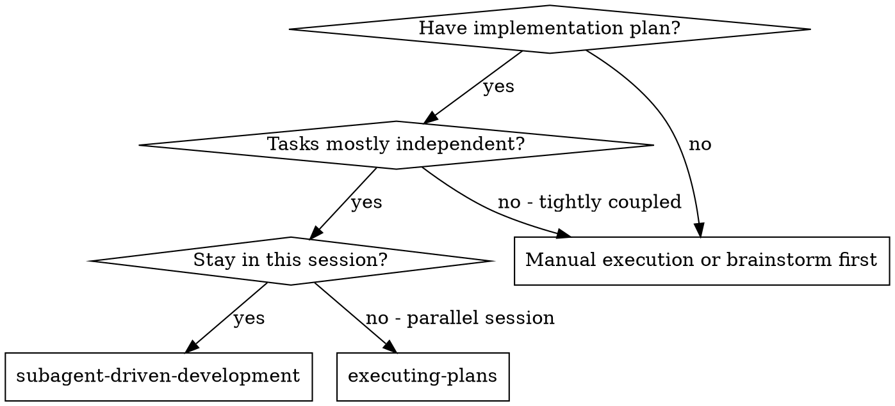
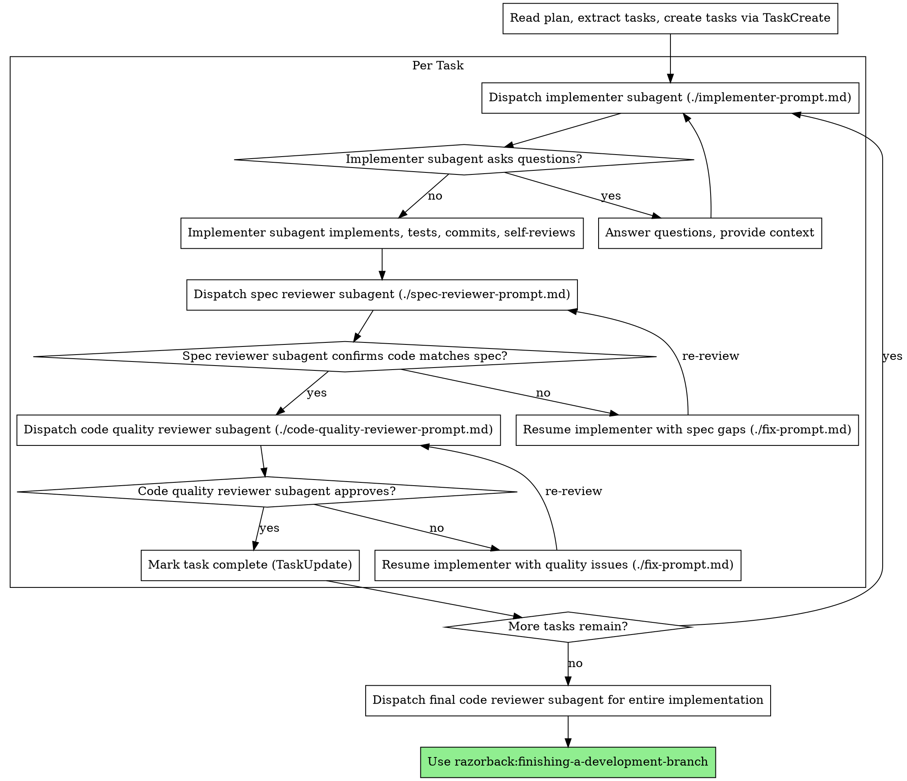

# Subagent-Driven Development (DEPRECATED)

> **This skill is deprecated.** Use `razorback:team-driven-development` instead.
>
> Team-driven development improves on this approach:
> - Teammates persist and can be messaged for fixes (no cold restart)
> - True parallelism (teammates work simultaneously)
> - Lead does inline review (no separate reviewer subagents)
> - Same Julie-powered orientation, lower total token cost
>
> The content below is kept for reference only.

---

Execute plan by dispatching fresh subagent per task, with code quality review after each. Spec compliance review is added when plans are vague or complex. When reviewers find issues, **resume** the implementer — never dispatch a fresh fix subagent.

**Core principle:** Fresh subagent per task + resume for fixes + right-sized review = high quality without wasted ceremony

## When to Use



**vs. Executing Plans (parallel session):**
- Same session (no context switch)
- Fresh subagent per task (no context pollution)
- Code quality review after each task, spec compliance when plan is vague or complex
- Faster iteration (no human-in-loop between tasks)

## The Process



## Prompt Templates

- `./implementer-prompt.md` - Dispatch implementer subagent
- `./fix-prompt.md` - Resume implementer to fix review issues
- `./spec-reviewer-prompt.md` - Dispatch spec compliance reviewer subagent
- `./code-quality-reviewer-prompt.md` - Dispatch code quality reviewer subagent

## Resume Over Fresh: Fixing Review Issues

When a reviewer finds issues, **resume the implementer subagent** — do not dispatch a fresh one.

A fresh subagent spends most of its budget re-orienting (reading files, understanding context, running Julie queries) before it can make a small fix. The implementer already has full context from its implementation pass. Resuming it skips all that orientation and goes straight to the fix.

**How it works:**
1. When the implementer completes, the Agent tool returns an **agent ID**. Save it.
2. When a reviewer finds issues, use `Agent(resume: "<agent-id>")` with the fix prompt from `./fix-prompt.md`.
3. The resumed subagent picks up with full prior context — files it read, decisions it made, tests it wrote.

**When to dispatch fresh instead:** Only if the implementer subagent's context is genuinely stale — e.g., another task modified the same files in between, or the fix requires a fundamentally different approach. This should be rare.

## When to Skip Spec Review

Spec compliance review catches mismatches between what was requested and what was built. It's valuable when there's room for misinterpretation — but when the plan is specific and the task is small, it just rubber-stamps the obvious.

**Skip spec review when:**
- The plan has specific acceptance criteria or detailed requirements (not vague bullets)
- The task is a single coherent feature (not a multi-part system)
- The implementer's report clearly addresses all requirements

**Keep spec review when:**
- The plan is high-level or ambiguous (light plans with broad "what to build" descriptions)
- The task has multiple interacting requirements that could be partially implemented
- The feature has subtle correctness constraints (e.g., security, data integrity)

When skipping spec review, the code quality reviewer still checks requirements as part of its review (the code-reviewer template already includes a "Requirements" section). The spec reviewer is an additional dedicated pass, not the only place requirements get checked.

## Example Workflow

```
You: I'm using Subagent-Driven Development to execute this plan.

[Read plan file once: docs/plans/feature-plan.md]
[Extract all 5 tasks with full text and context]
[Create tasks with TaskCreate]

Task 1: Hook installation script

[Get Task 1 text and context (already extracted)]
[Dispatch implementation subagent with full task text + context]

Implementer: "Before I begin - should the hook be installed at user or system level?"

You: "User level (~/.config/razorback/hooks/)"

Implementer: "Got it. Implementing now..."
[Later] Implementer:
  - Implemented install-hook command
  - Added tests, 5/5 passing
  - Self-review: Found I missed --force flag, added it
  - Committed

[Dispatch spec compliance reviewer]
Spec reviewer: ✅ Spec compliant - all requirements met, nothing extra

[Get git SHAs, dispatch code quality reviewer]
Code reviewer: Strengths: Good test coverage, clean. Issues: None. Approved.

[Mark Task 1 complete]

Task 2: Recovery modes

[Get Task 2 text and context (already extracted)]
[Dispatch implementation subagent with full task text + context]

Implementer: [No questions, proceeds]
Implementer:
  - Added verify/repair modes
  - 8/8 tests passing
  - Self-review: All good
  - Committed

[Dispatch spec compliance reviewer]
Spec reviewer: ❌ Issues:
  - Missing: Progress reporting (spec says "report every 100 items")
  - Extra: Added --json flag (not requested)

[Resume implementer (agent ID from earlier) with spec issues]
Implementer: Removed --json flag, added progress reporting

[Spec reviewer reviews again]
Spec reviewer: ✅ Spec compliant now

[Dispatch code quality reviewer]
Code reviewer: Strengths: Solid. Issues (Important): Magic number (100)

[Resume implementer (same agent ID) with quality issues]
Implementer: Extracted PROGRESS_INTERVAL constant

[Code reviewer reviews again]
Code reviewer: ✅ Approved

[Mark Task 2 complete]

...

[After all tasks]
[Dispatch final code-reviewer]
Final reviewer: All requirements met, ready to merge

Done!
```

## Advantages

**vs. Manual execution:**
- Subagents follow TDD naturally
- Fresh context per task (no confusion)
- Parallel-safe (subagents don't interfere)
- Subagent can ask questions (before AND during work)

**vs. Executing Plans:**
- Same session (no handoff)
- Continuous progress (no waiting)
- Review checkpoints automatic

**Efficiency gains:**
- No file reading overhead (controller provides full text)
- Controller curates exactly what context is needed
- Subagent gets complete information upfront
- Questions surfaced before work begins (not after)
- Julie tools replace Glob/Grep/Read chains (2-3 calls vs 5-8 for orientation)

**Quality gates:**
- Self-review catches issues before handoff
- Code quality review always, spec compliance review when needed
- Review loops ensure fixes actually work
- Code quality ensures implementation is well-built

**Cost:**
- Subagent invocations scale with plan complexity (implementer + 1-2 reviewers per task)
- Controller does more prep work (extracting all tasks upfront)
- Review loops add iterations
- But catches issues early (cheaper than debugging later)

## Red Flags

**Never:**
- Start implementation on main/master branch without explicit user consent
- Skip code quality review (always mandatory — consistently catches real issues)
- Proceed with unfixed issues
- Dispatch multiple implementation subagents in parallel (conflicts)
- Make subagent read plan file (provide full text instead)
- Skip scene-setting context (subagent needs to understand where task fits)
- Ignore subagent questions (answer before letting them proceed)
- Skip review loops (reviewer found issues = implementer fixes = review again)
- Let implementer self-review replace actual review (both are needed)
- If running spec review: **start code quality review before spec compliance is done** (wrong order)
- Move to next task while any review has open issues

**If subagent asks questions:**
- Answer clearly and completely
- Provide additional context if needed
- Don't rush them into implementation

**If reviewer finds issues:**
- **Resume** the implementer subagent (Agent tool `resume` parameter with saved agent ID)
- Provide reviewer findings via `./fix-prompt.md`
- Reviewer reviews again after fix
- Repeat until approved
- Don't skip the re-review
- Don't dispatch a fresh subagent — it wastes tokens re-orienting on code the implementer already knows

**If implementer subagent is unreachable** (session error, context limit):
- Dispatch fresh subagent with specific fix instructions + reviewer findings
- This is the fallback, not the default

## Integration

**Required workflow skills:**
- **razorback:using-git-worktrees** - REQUIRED: Set up isolated workspace before starting
- **razorback:writing-plans** - Creates the plan this skill executes
- **razorback:requesting-code-review** - Code review template for reviewer subagents
- **razorback:finishing-a-development-branch** - Complete development after all tasks

**Subagents should use:**
- **razorback:test-driven-development** - Subagents follow TDD for each task

**Alternative workflow:**
- **razorback:executing-plans** - Use for parallel session instead of same-session execution
