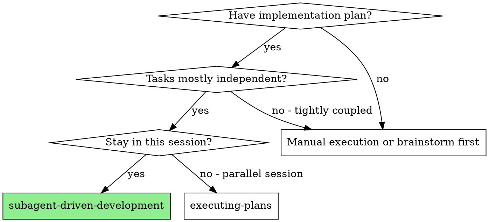
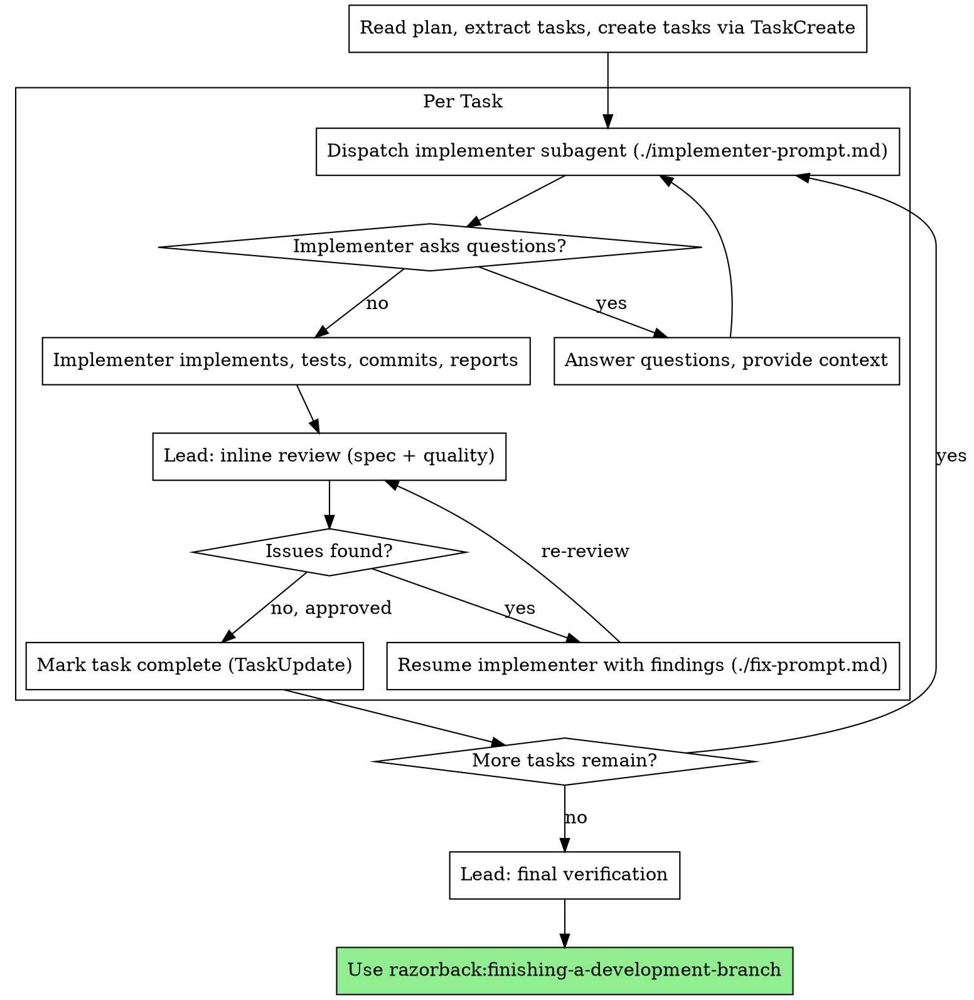

# Subagent-Driven Development

Execute a plan by dispatching fresh subagents per task, with the lead doing inline review (spec compliance + code quality) after each task. Independent tasks can be dispatched in parallel; tightly coupled tasks run sequentially. For fixes, dispatch a fresh implementer with the fix prompt and prior-task context.

**Core principle:** Fresh subagent per task + inline review by lead + parallel fan-out when tasks are independent = high quality without wasted ceremony.

**Dispatch mechanism:**
- **Claude Code:** `Agent` tool (one call per subagent; multiple calls in one turn run in parallel).
- **opencode:** `Task` tool (one call per subagent; multiple calls in one turn run in parallel). The built-in `general` subagent is suitable for most implementer work; `@mention` also works for manual invocation.
- **Codex:** `spawn_agent(agent_type="worker", message=<filled prompt>)` (one call per subagent; multiple calls in one turn run in parallel). Keep the returned agent ID, `send_input(target=<agent-id>, message=...)` feeds follow-ups (the closest thing to Claude Code's resume), `wait_agent(targets=[<agent-id>])` blocks until the agent finishes, and `close_agent(target=<agent-id>)` frees the slot. Requires `multi_agent = true` in `~/.codex/config.toml` (see `skills/using-razorback/references/codex-tools.md`).
- **Gemini CLI:** `invoke_agent(agent_name="generalist", prompt=<filled prompt>)` (parallel by default; set `wait_for_previous: true` only when you need a call serialized behind earlier ones). Resume is not available — route fix rounds via a fresh `invoke_agent` call with the fix prompt and prior-task context. Subagents cannot recursively dispatch other subagents, so all worker dispatch happens from the lead session.
- **Explicit Cursor/Composer delegation from another harness:** use `razorback:cursor-agent` to call `cursor-agent` with `--model composer-2.5-fast`. Codex or the current lead still owns planning, review, fix routing, and final verification; Cursor Agent is only the implementation worker.

If the harness supports per-agent model or reasoning selection, apply the plan's Model Routing tier when dispatching. If it does not, use `inherit` and note that in the task report.

## When to Use



**vs. Executing Plans (parallel session):**
- Same session (no context switch)
- Fresh subagent per task (no context pollution)
- Lead does inline review after each task (one pass, no reviewer subagents)
- Faster iteration (no human-in-loop between tasks)

**Harness-specific follow-up behavior:**
- Claude Code can resume an existing implementer for fix rounds
- Codex can use `send_input` on the stored worker for fix rounds
- OpenCode and Gemini CLI use fresh dispatches with fix context because resume is not available
- The execution model stays the same across harnesses: dispatch per task, inline review by lead, parallel fan-out only when files do not overlap

## The Process



## Step 1: Extract Tasks from the Plan

Read the plan file once. Extract every task with its full text and surrounding context. Create tracking tasks via `TaskCreate` so progress is visible.

Before dispatching, orient yourself on the codebase with Miller:
- **Orient** around the areas the plan touches with `context`
- **List a file's symbols** on files the plan will modify with `inspect`, so you can spot later drift during review
- Do NOT chain Glob/Grep/Read for orientation — Miller is the required entry point

## Step 2: Dispatch Implementer Subagent

Use the template at `./implementer-prompt.md`. The spawn prompt MUST include:

1. **Task text** copied from the plan (don't make the subagent read the plan file)
2. **Scene-setting context** (how this task fits the larger plan)
3. **File ownership** (which files this task may modify)
4. **Miller directives** (orient, inspect before modifying any symbol, find references before changing public APIs, list a file's symbols before reading full files)
5. **TDD expectations** (from `razorback:test-driven-development`)
6. **Verification scope** specific to this task, using commands from the plan's verification strategy
7. **Model routing tier** assigned to this task (`implementation`, `mechanical`, `strategy`, `gate-review`, or `escalation`)
8. **Miller evidence requirement** (the implementer must report which Miller calls they used and what those calls confirmed)
9. **Gate invariant requirement** (the implementer must state what each assigned test, replay, metric, or acceptance gate proves)
10. **architecture-quality context** (the approved architecture, any `No Architecture Impact` note, and the plan mismatch rule)

### Model Routing Contract

Read the plan's Model Routing section before dispatching any worker. Model names are harness-specific mappings; the workflow uses role/risk tiers.

Harness-specific dispatch:
- **Claude Code:** Agent tool `model` parameter accepts `opus`, `sonnet`, `haiku`. Translate full model IDs to the short form.
- **Codex:** `spawn_agent(agent_type="worker", message=..., model=<mapped model>, reasoning_effort=<mapped effort>)` when the session supports per-agent model selection. For CLI helper invocations (`codex exec`), use `-m <model>`. If neither is available, inherit the global default.
- **Cursor:** model selection is IDE-level; use `inherit` and note the limitation.
- **OpenCode / Copilot CLI:** use the harness model parameter if available, otherwise `inherit`.

| Tier | Owner | Use when |
|------|-------|----------|
| `strategy` | Lead | Planning, architecture, decomposition, inline review, finding triage |
| `implementation` | Worker | Bounded tasks from a clear plan with narrow ownership and tests |
| `mechanical` | Worker | Docs, fixtures, rote edits, formatting, manifests with no gate ownership |
| `gate-review` | Lead or reviewer | Plan plus failing test, replay, metric, or diff triage to decide whether the gate or implementation is wrong |
| `escalation` | Lead or worker | Security, subtle correctness, high blast radius, weak tests, gate interpretation, repeated failures |

Mechanical-tier workers must not own failing tests, replay evidence, metrics, or
acceptance gates. A docs or fixture task stays mechanical only when it records
already-decided evidence. If the task must decide what the evidence means, use
gate-review, strategy, or escalation tier.

Implementation-tier workers are allowed only when all are true:
- The task has clear acceptance criteria.
- File ownership is narrow and non-overlapping.
- The expected change is local.
- The relevant behavior has a narrow verification scope.
- The task does not depend on hidden shared invariants.
- The task does not require interpreting replay, metric, or acceptance-gate semantics.

Do not use implementation-tier workers unattended for shared lifecycle behavior, concurrency, public API contracts with many callers, weak tests, replay or metric interpretation, or findings involving subtle correctness. Use strategy/escalation tier, or split strategy-tier investigation from implementation-tier edits.

Escalate after two failed worker attempts, one failure involving hidden invariants, assigned verification failure not covered by the plan, or any plan-contradicting code discovery.

### Verification Scope Contract

Razorback is language-agnostic. The target repo supplies concrete commands through its docs and the plan's Verification Strategy.

Use these scope labels in worker prompts and reports:

| Scope | Owner | When |
|-------|-------|------|
| `worker-red-green` | Implementer | Prove the new or changed behavior during TDD with the lowest-cost repo-defined command |
| `worker-ceiling` | Implementer | Maximum scope a worker may run without lead assignment |
| `affected-change` | Lead | Check touched files, changed subsystem, or repo-defined affected area after a coherent batch |
| `branch-gate` | Lead | Broad confidence before handoff, push, or PR |
| `expensive-specialist` | Lead | Slow domain gates only when touched areas or failures require them |

Workers do not own `affected-change`, `branch-gate`, or `expensive-specialist`
scopes. The lead owns those gates and the ledger entries for them. If the lead
asks a worker to run a broad command for diagnostic output, the worker must
label it diagnostic, not acceptance evidence.

Workers stop and report when assigned verification fails unless the plan
explicitly says to update that gate. A failing assigned gate is not acceptance
evidence.

For each assigned gate, the worker report must state the invariant the gate
proves. For replay or metric evidence, it must also identify hard-gate metrics
and report-only metrics.

Maintain a verification ledger during execution:

```markdown
| Scope | Invariant | Command | Commit | Result | Time |
|-------|-----------|---------|--------|--------|------|
```

If the same HEAD already has a passing ledger entry for the required scope, reuse that evidence instead of rerunning the same expensive command. If HEAD changed, the affected scopes are stale.

Per-harness state to keep after dispatch:

- **Claude Code:** save the **agent ID** returned by the dispatch so you can resume the subagent for fixes (preserves its orientation context).
- **opencode:** the Task tool does not expose persistent resume, so fixes go to a fresh subagent with fix context included (see Step 4).
- **Codex:** save the **agent ID** returned by `spawn_agent` so you can `send_input` for follow-ups, `wait_agent` for completion, and `close_agent` when the task is done. `send_input` is Codex's closest analogue to Claude Code's resume, and the worker keeps its orientation context between messages.

If the subagent asks questions, answer completely before letting it proceed.

### Parallel Dispatch (Independent Tasks)

When the plan has 2+ independent tasks (non-overlapping files, no ordering dependency), dispatch them in parallel:

- **Claude Code:** make multiple `Agent` tool calls in a single turn. They run concurrently and you review each as it reports back.
- **opencode:** make multiple `Task` tool calls in a single turn (or in the TUI, @mention the `general` subagent concurrently). Child sessions run in parallel; navigate with `session_child_*` keybinds.
- **Codex:** make multiple `spawn_agent` calls in a single turn. Each returns its own agent ID. Use `wait_agent(targets=[<agent-id>])` per agent, or pass multiple IDs at once, when you need a given implementer's output before proceeding with its review.

Assign file ownership per subagent to prevent collisions. If tasks are tightly coupled (same files, shared state, ordering dependency), dispatch sequentially instead — one subagent at a time, lead reviews, then next.

Reviews still happen inline per-task. Do not batch reviews — a failing task shouldn't block review of the ones that passed.

## Step 3: Lead Inline Review

When the implementer reports completion, the lead does a single inline review covering both spec compliance and code quality. No reviewer subagents — the lead does this directly.

**Spec compliance:**
- Did the implementer build everything requested?
- Did they add anything not requested? Flag extras for removal.
- Did they misinterpret any requirement?
- **List a file's symbols** to scan changed files without reading them fully with Miller `inspect`.
- Confirm the report includes the Miller calls used. If the implementer cannot
  show Miller-first orientation, send it back.

**architecture-quality review:**
- Did the worker preserve the approved architecture shape, or did it report a plan mismatch when code reality disagreed?
- Does this keep complexity local?
- Is the caller-facing interface smaller than the behavior it unlocks?
- Are tests written through the same interface callers use?
- Did new seams earn their keep?
- Did this avoid speculative extensibility?
- Did it fix the structural cause, not only the symptom?

**Code quality:**
- Is the code clean, tested, and maintainable?
- Do tests assert on meaningful values (not just "code ran without crashing")?
- Code smells: duplication, tight coupling, unclear names, missing error paths?
- **Inspect** key new/modified symbols to check callers, callees, and types with Miller `inspect depth=full`.
- **Find references** to verify API changes don't break dependents with Miller `trace`.

**Review cap: 3 iterations.**

- On Claude Code: 3 resume-the-implementer attempts using `./fix-prompt.md`.
- On Codex: 3 `send_input(...)` follow-ups on the stored worker.
- On OpenCode: 3 fresh-dispatch-with-fix-context attempts.

If the 3rd iteration still fails:

1. Dispatch a **fresh implementer with reframed context** using `./fix-prompt.md`'s "Reframed-Context Attempt" section — different framing (different ownership, explicit plan disambiguation, simpler decomposition, or a prior-commit pointer so the fresh agent can read what was tried without rediscovering it).
2. If the fresh attempt also fails, flag the task in the morning report's "Blockers hit" section and continue with remaining tasks.
3. Escalate to the user only if the failure matches blocker taxonomy #5 (unresolvable test failures blocking the whole plan).

### When Lighter Review Is Appropriate

Spec compliance checking earns its keep when the plan leaves room for misinterpretation. When the plan is concrete, the review can focus on quality:

**Lighter (quality-focused) review when:**
- The plan has specific acceptance criteria or detailed requirements
- The task is a single coherent feature (not a multi-part system)
- The implementer's report clearly addresses every requirement

**Full (spec + quality) review when:**
- The plan is high-level or ambiguous
- The task has multiple interacting requirements that could be partially implemented
- The feature has subtle correctness constraints (security, data integrity)

Either way, the review is a single pass by the lead. Never collapse the loop to skip re-reviewing after a fix.

## Step 4: Fixes

When review finds issues, route the fix back to an implementer with the reviewer findings.

**Claude Code (prefer resume):** Use `Agent(resume: "<agent-id>")` with the prompt from `./fix-prompt.md`. The resumed subagent keeps its orientation context — files read, decisions made, tests written — and goes straight to the fix instead of re-reading the codebase.

**opencode (dispatch fresh with context):** The Task tool doesn't expose persistent resume. Dispatch a fresh implementer via the Task tool (or @mention `general`) using `./fix-prompt.md` plus:
- The original task text
- A pointer to the commit(s) the prior implementer produced (so the fresh subagent can `git show` or read the files instead of rediscovering them)
- The reviewer findings

**Codex (prefer send_input):** Call `send_input(target=<stored agent-id>, message=<filled fix-prompt.md>)` on the existing worker for iterations 1-3. The worker keeps its orientation context and behaves like a Claude Code resume. For iteration 4 (reframed-context attempt), call `close_agent(target=<agent-id>)` on the old worker, then `spawn_agent(agent_type="worker", message=<filled fix-prompt.md with the Reframed-Context Attempt section + prior-commit SHAs>)` for a fresh worker. If the stored agent ID is gone (session restart, compaction), fall back to a fresh `spawn_agent` with the prior-commit pointer, same shape as the opencode branch above.

Either way, re-review after the fix. Iteration cap applies: 3 resume / `send_input` / fresh-dispatch attempts, then a 4th attempt with reframed context, then flag-and-continue (see "Review cap" in Step 3).

**When to dispatch fresh on Claude Code (or Codex):** the subagent is unreachable (session error, context limit), the prior implementer's context is genuinely stale (another task modified the same files), or the fix needs a fundamentally different approach.

## Step 4a: Pre-merge external review (if chosen)

If the reviewer choice propagated from `writing-plans` (via the execution handoff) is `codex`, `gemini`, or `claude`:

**First**, ensure the verification ledger has a passing `branch-gate` entry for the current HEAD. If it does not, run the branch-gate scope now and record the result. `pre-merge-review` requires this as a precondition; do not skip it.

**Then** invoke `razorback:pre-merge-review`, passing:

- plan path
- reviewer choice
- verification strategy
- verification ledger
- model routing

If the choice is `none` (or absent), skip Step 4a.

Pre-merge-review builds the full branch diff, dispatches the chosen reviewer in adversarial read-only mode, classifies findings (real-bug / real-improvement / false-positive / out-of-scope), dispatches fresh implementer subagents for verified fixes, runs the required verification scope for the resulting HEAD, and emits a summary block for the morning report. Single pass; no round-two review.

After `pre-merge-review` returns, proceed to Step 5 (Complete → `razorback:finishing-a-development-branch`).

## Step 5: Complete

When all tasks are approved and marked complete:

1. **Final verification:** Run the plan's `branch-gate` scope, or reuse a passing verification-ledger entry for the same HEAD and scope. Add any `expensive-specialist` scopes required by touched areas.
2. **Finish:** Use `razorback:finishing-a-development-branch`.

## Blockers

The authoritative taxonomy is `skills/using-razorback/references/blocker-taxonomy.md`. Consult it before stopping.

**Bias rules:**
- When in doubt, press on and flag. A line in the morning report is cheaper than a false wake-up.
- Never silently swallow a judgment call. Every non-obvious decision ends up in the report with file:line + reason.

**Real blockers (stop and report):**
1. Credentials / auth / env broken, with no recovery path in the plan
2. Destructive action not authorized by the plan
3. Plan-contradicting data (codebase reality invalidates a load-bearing assumption)
4. Safety-critical ambiguity (security, data integrity, billing, auth) with no plan answer
5. Unresolvable test failures (repeated fix attempts do not converge)

Anything else: pick the plan-consistent option, note the choice in your report, continue. Full definitions in the taxonomy.

## Checkpoints

The lead writes a `goldfish:checkpoint` at four points during the run. This persists phase-level progress and decisions across auto-compaction and session restarts.

1. **Phase boundary** — after each phase of a multi-phase plan: "Phase N of M complete. Decisions: …. Next: Phase N+1."
2. **Pre-review** — before Step 4a begins (if a reviewer was chosen): captures reviewer choice, diff range, verification strategy.
3. **Post-review** — after Step 4a completes: captures findings, classifications, fix commits.
4. **Post-PR** — after `finishing-a-development-branch` creates the PR: final state.

Checkpoint at phase granularity, not per task or per subagent dispatch. Per-task checkpoints are noise; per-phase is enough to recover.

## Recovery

On detecting a resumed run (post-compaction note, mismatch between expected and actual conversation state, or the user says "resume"), the lead follows this fixed orientation sequence before continuing:

1. `goldfish:recall` — retrieve the active brief and recent checkpoints.
2. Read the plan file.
3. Check the TaskList for completed / in-progress / pending tasks.
4. `git log --oneline <base>..HEAD` — verify what is actually committed.
5. Identify the next incomplete task and resume execution.

This sequence runs only on resumed runs. A fresh run dispatches directly into Step 1 (Extract Tasks from the Plan). Subagent IDs from the prior session cannot be resumed post-compaction — treat any needed fix as a fresh dispatch with prior-commit context.

## Prompt Templates

- `./implementer-prompt.md` — Dispatch implementer subagent
- `./fix-prompt.md` — Resume implementer to fix review issues
- `./spec-reviewer-prompt.md` and `./code-quality-reviewer-prompt.md` — Review checklists the lead consults during inline review. Not dispatched as separate subagents; they encode the criteria the lead applies directly.

## Example Workflow

```
You: I'm using Subagent-Driven Development to execute this plan.

[Read plan file once: docs/plans/feature-plan.md]
[orient on "hook installation recovery"]
[Extract all 5 tasks with full text and context]
[TaskCreate for each task]

--- Task 1: Hook installation script ---

[Dispatch implementer subagent with full task text + context + Miller directives]
[Save agent ID: impl-a1b2]

Implementer (impl-a1b2): "Before I begin — should the hook be installed at user or system level?"

You: "User level (~/.config/razorback/hooks/)."

Implementer: "Got it. Implementing now..."
[Later] Implementer reports:
  - Implemented install-hook command
  - Added tests, 5/5 passing
  - Committed (SHA abc123)
  Status: DONE

[Lead inline review]
[list symbols in install-hook.ts to scan structure]
[inspect installHook() to check flow]
[Spec check: all requirements met, nothing extra]
[Quality check: clean, well-tested, no smells]
[Approved — TaskUpdate task 1 completed]

--- Task 2: Recovery modes ---

[Dispatch implementer subagent. Save agent ID: impl-c3d4]
Implementer: [No questions, proceeds]
Implementer reports:
  - Added verify/repair modes
  - Worker-scope verification passing
  - Committed (SHA def456)
  Status: DONE

[Lead inline review]
[list symbols in recovery.ts]
[inspect verifyMode(), repairMode()]
[Spec check: MISSING — progress reporting ("report every 100 items")]
[Spec check: EXTRA — --json flag not requested]
[Quality check: magic number 100 hard-coded]

[Resume impl-c3d4 with ./fix-prompt.md:]
  "Three issues:
   1. Spec: add progress reporting every 100 items (missing)
   2. Spec: remove --json flag (not requested)
   3. Quality: extract 100 into a PROGRESS_INTERVAL constant"

Implementer (resumed): Progress reporting added, --json removed,
  PROGRESS_INTERVAL extracted. Tests still passing. Committed (SHA ghi789).

[Lead re-review]
[Approved — TaskUpdate task 2 completed]

--- ...remaining tasks follow the same pattern... ---

[After all tasks complete]
[Lead final verification: branch-gate scope, plus any required specialist scopes]
[Verification ledger updated]
[Use razorback:finishing-a-development-branch]

Done.
```

## Advantages

**vs. Manual execution:**
- Subagents follow TDD naturally
- Fresh context per task (no confusion)
- Real blockers surface early without stopping the run for ordinary ambiguity

**vs. Executing Plans:**
- Same session (no handoff)
- Continuous progress (no waiting)
- Review checkpoints automatic

**Efficiency gains:**
- Lead curates exactly what context each subagent needs
- No file reading overhead inside the subagent (lead provides full text)
- Real blockers surface before work begins; ordinary ambiguity follows decide-and-note
- Miller replaces Glob/Grep/Read chains (2-3 calls vs 5-8 for orientation)
- Inline review by lead avoids spawning reviewer subagents (lower total token cost)

**Quality gates:**
- Inline review catches spec + quality issues in one pass
- On Claude Code, resume-for-fix preserves the implementer's context; on opencode, fix-dispatch includes prior commits as context
- Re-review loop ensures fixes actually work

**Cost:**
- Subagent invocations scale with plan complexity (one implementer per task, plus fix rounds)
- Lead does more prep (extracting tasks, curating context, reviewing inline)
- Catches issues early — cheaper than debugging later

## Red Flags

**Never:**
- Start implementation on main/master branch without explicit user consent
- Skip inline review (it consistently catches real issues)
- Proceed to the next task while any review has open issues
- Dispatch parallel implementer subagents on overlapping files (conflicts)
- Make the subagent read the plan file (provide the full task text instead)
- Skip scene-setting context (the subagent needs to know where the task fits)
- Ignore subagent questions (answer before letting them proceed)
- Skip the re-review after a fix
- Dispatch a separate reviewer subagent when the lead can review inline
- Approve work from an implementer who cannot show Miller-first orientation
- **On Claude Code, prefer resume for iterations 1-3** (the implementer has full context). Use fresh-dispatch-with-reframed-context for iteration 4 only, after 3 resume attempts failed. The 4th attempt's value is the reframing, not the freshness.
- **On Codex, prefer `send_input` on the stored agent ID for iterations 1-3** (same reasoning, the worker keeps its orientation context). Use `close_agent` + fresh `spawn_agent` with reframed context for iteration 4.
- Never pause for user input between tasks - the plan is approved, run it to completion. Stops are governed by the blocker taxonomy. If you can reason through a plan-consistent path, keep moving and log the choice.

**If the subagent asks questions:**
- Answer clearly and completely
- Provide additional context if needed
- Don't rush them into implementation

**If review finds issues:**
- Claude Code: resume the implementer subagent with `./fix-prompt.md` + reviewer findings
- opencode: dispatch a fresh implementer with `./fix-prompt.md` + reviewer findings + pointer to prior commits
- Codex: `send_input(target=<agent-id>, ...)` on the stored worker with `./fix-prompt.md` + reviewer findings for iterations 1-3; `close_agent(target=<agent-id>)` + fresh `spawn_agent` with reframed context for iteration 4
- Re-review after the fix
- Iteration cap: 3 resume / `send_input` / fresh-dispatch attempts → 4th attempt with reframed-context (see `./fix-prompt.md`) → flag the task in the morning report and continue with remaining tasks. Escalate to the user only for blocker taxonomy #5.

## Integration

**Required workflow skills:**
- **razorback:using-git-worktrees** — Set up isolated workspace before starting. Skip only with explicit user consent (small, single-session work where a feature branch is sufficient).
- **razorback:writing-plans** — Creates the plan this skill executes
- **razorback:requesting-code-review** — Review criteria the lead applies during inline review
- **razorback:finishing-a-development-branch** — Complete development after all tasks

**Subagents should follow:**
- **razorback:test-driven-development** — TDD for each task (embedded in the implementer prompt)

**Alternative workflows:**
- **razorback:executing-plans** — Use for parallel-session, single-agent, or no-delegation execution

**Codex-specific:**
- Requires `multi_agent = true` in `~/.codex/config.toml` (see `skills/using-razorback/references/codex-tools.md`). Without it, `spawn_agent` / `send_input` / `wait_agent` / `close_agent` are not available.
- **`close_agent(target=<agent-id>)` MUST be called** when the worker is no longer needed, after a task's review is approved and you're not going to `send_input` again, or after the 4th-iteration flag-and-continue. Codex has a bounded agent-slot pool; leaking slots starves later dispatches in the same run.
