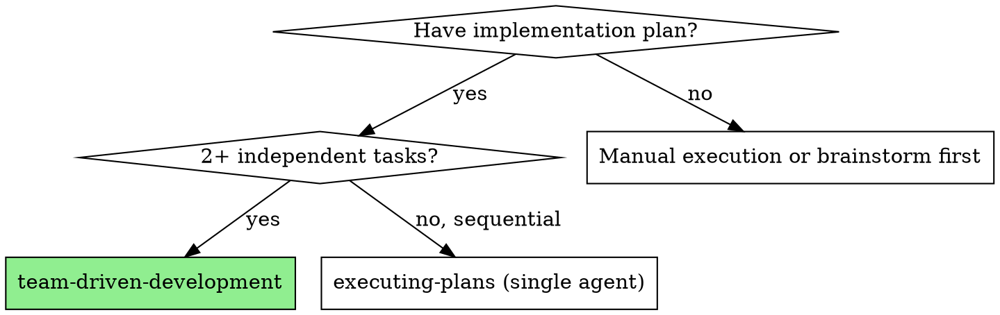
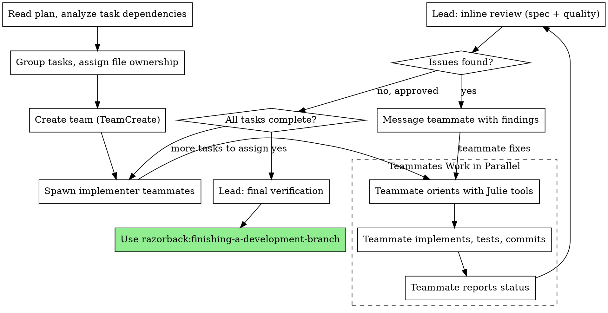

# Team-Driven Development

Execute plans by creating an Agent Team. Each teammate owns a set of tasks and files, works in parallel with Julie-powered codebase orientation, and persists for the entire session. The lead monitors progress, does inline review, and messages teammates directly for fixes.

**Core principle:** Parallel teammates + Julie orientation + persistent context for fixes = fast, high-quality execution without cold-start waste.

## When to Use



**vs. Executing Plans (single agent):**
- Parallel execution (teammates work simultaneously)
- Persistent teammates (no cold restart for fixes)
- File ownership prevents conflicts
- Julie-powered orientation in each teammate's prompt

**vs. Subagent-Driven Development (DEPRECATED):**
- Teammates persist and can be messaged for fixes (subagents required resume or fresh dispatch)
- True parallelism (subagents were sequential per-task)
- Lead does inline review (no separate reviewer subagents needed)
- Same Julie-powered orientation, lower total token cost

## The Process



## Step 1: Analyze Plan and Assign Ownership

Read the plan and identify:

1. **Task dependencies:** Which tasks can run in parallel? Which must wait?
2. **File ownership:** Which files does each task touch? No two teammates should modify the same file.
3. **Team size:** 2-4 teammates for most plans. More than 5 rarely helps. One task per teammate is ideal; group small related tasks if needed.

**File ownership is critical.** Two teammates editing the same file causes overwrites. If tasks share files, either:
- Sequence them (one teammate, then the next)
- Redesign the split (refactor the plan so tasks touch different files)
- Assign to the same teammate

## Step 2: Create Team and Spawn Teammates

Create the team, then spawn one teammate per task group.

**Each teammate spawn prompt MUST include:**

1. **Task assignment** with full text from plan (don't make them read the plan file)
2. **File ownership** listing exactly which files they own
3. **Julie tool directives** (see teammate prompt template below)
4. **Verification commands** specific to their task
5. **Status protocol** (see below)

Use the teammate prompt template at `./implementer-prompt.md`.

```
TeamCreate:
  name: "[feature]-team"

For each task group:
  Agent tool:
    description: "Implement [task name]"
    name: "[task-name]-implementer"
    prompt: [follow ./implementer-prompt.md template]
```

## Step 3: Monitor and Review

As teammates work, monitor their progress. When a teammate reports completion:

**Inline review checklist (lead does this, no reviewer subagents):**

**Spec compliance:**
- Did they implement everything requested? Compare actual code to task requirements.
- Did they add anything not requested? Flag extra work for removal.
- Did they misinterpret any requirements?
- Use `get_symbols(file_path)` to quickly scan changed files without reading them fully.

**Code quality:**
- Is the code clean, tested, and maintainable?
- Do tests actually verify behavior (not just that code runs)?
- Are there any code smells: duplication, tight coupling, unclear names?
- Use `deep_dive(symbol)` on key new/modified symbols to check callers/callees/types.
- Use `fast_refs(symbol)` to verify changes don't break dependents.

**Review cap: 3 iterations via SendMessage.** If a teammate can't resolve the issues in 3 rounds:

1. Dispatch a **fresh implementer teammate** (new name) with **reframed context** — different file-ownership framing, explicit plan disambiguation, or a simpler task decomposition.
2. If the fresh teammate also fails, flag the task in the morning report's "Blockers hit" section with reason and commit state, and **continue with remaining work**.
3. Escalate to the user only if the failure matches blocker taxonomy #5 (unresolvable test failures blocking the whole plan — not just one task).

## Step 4: Fix Issues via Message

When review finds issues, **message the teammate directly:**

```
SendMessage:
  to: "[teammate-name]"
  message: |
    Review found issues with your implementation:

    [List specific issues with file:line references]

    Fix these, run tests, commit, and report back.
    Keep it focused - fix what's flagged, don't refactor beyond that.
```

**Why messaging beats fresh dispatch:** The teammate already has full context from implementation - files read, decisions made, tests written. A fresh agent would burn tokens just getting back to where the teammate already is. This is the key advantage of teams over subagents.

## Step 5: Final verification

After all teammates finish and reviews pass:

1. Run the full test suite. Check for integration issues between teammates' work.
2. `TeamDelete` to shut down the team.

## Step 5a: Pre-merge external review (if chosen)

If the reviewer choice (propagated from `writing-plans` via the plan-approval message) is one of `codex`, `gemini`, or `claude`, invoke `razorback:pre-merge-review`, passing:

- plan path
- reviewer choice
- project test command (from plan or from the lead's knowledge)

If the reviewer choice is `none` (or absent), skip Step 5a entirely.

After `razorback:pre-merge-review` returns its morning-report summary block, proceed to Step 6.

## Step 6: Finish

Use `razorback:finishing-a-development-branch`.

## Teammate Status Protocol

Teammates report one of four statuses:

| Status | Meaning | Lead action |
|--------|---------|-------------|
| **DONE** | All tasks implemented, tested, committed | Inline review |
| **DONE_WITH_CONCERNS** | Complete, but has questions or doubts | Review + address concerns |
| **BLOCKED** | Can't proceed without help | Unblock: provide info, adjust plan, or reassign |
| **NEEDS_CONTEXT** | Missing codebase knowledge | Provide context or point to relevant files/symbols |

## When to Skip Spec Compliance Check

Same criteria as subagent-driven-development:

**Skip when:**
- Plan has specific acceptance criteria (not vague bullets)
- Task is a single coherent feature
- Teammate's report clearly addresses all requirements

**Keep when:**
- Plan is high-level or ambiguous
- Task has multiple interacting requirements
- Feature has subtle correctness constraints

When skipping spec check, the quality review still covers requirements.

## Prompt Templates

- `./implementer-prompt.md` - Teammate spawn prompt with Julie directives and file ownership

The reviewer prompts from subagent-driven-development (`spec-reviewer-prompt.md`, `code-quality-reviewer-prompt.md`) serve as review guides for the lead's inline review. The lead doesn't dispatch reviewer agents; instead, the lead uses those criteria directly.

## Example Workflow

```
You: I'm using Team-Driven Development to execute this plan.

[Read plan file: docs/plans/auth-overhaul.md]
[Analyze: 4 tasks, 3 are independent, task 4 depends on task 1]
[File ownership: Task 1 owns auth/, Task 2 owns middleware/, Task 3 owns tests/integration/]

[TeamCreate: "auth-overhaul-team"]

[Spawn teammate "session-handler" for Task 1: Session management]
[Spawn teammate "middleware-guard" for Task 2: Auth middleware]
[Spawn teammate "integration-tests" for Task 3: Integration test suite]
[Task 4 waits for Task 1 to complete]

--- Teammates work in parallel ---

middleware-guard reports: DONE
  - Implemented auth middleware with role-based checks
  - 12/12 tests passing
  - Committed

[Lead inline review: get_symbols on changed files, deep_dive on AuthMiddleware]
[Spec check: all requirements met]
[Quality check: clean, well-tested]
[Approved - mark Task 2 complete]

session-handler reports: DONE_WITH_CONCERNS
  - Implemented session store with Redis backend
  - 8/8 tests passing
  - Concern: TTL defaults may be too aggressive for mobile clients

[Lead inline review]
[Spec check: complete]
[Quality check: one issue - magic number for TTL]

[SendMessage to session-handler:]
  "Two things:
   1. Extract TTL to a named constant (SESSION_TTL_SECONDS)
   2. Your concern about mobile TTL is valid - add a comment noting
      this may need tuning. We'll address it in a follow-up."

session-handler: Fixed. TTL constant extracted, comment added, committed.

[Re-review: approved. Mark Task 1 complete]

[Now spawn teammate for Task 4 (depends on Task 1)]
[Spawn teammate "token-refresh" for Task 4: Token refresh flow]

integration-tests reports: DONE
[Lead inline review: approved. Mark Task 3 complete]

token-refresh reports: DONE
[Lead inline review: approved. Mark Task 4 complete]

[All tasks complete]
[Run full test suite - all passing]
[TeamDelete: "auth-overhaul-team"]
[Use razorback:finishing-a-development-branch]
```

## Red Flags

**Never:**
- Start implementation on main/master branch without explicit user consent
- Let two teammates modify the same file (file conflicts overwrite work)
- Skip inline review (it consistently catches real issues)
- Skip the fix-and-re-review loop (if review found issues, they must be fixed AND re-reviewed)
- Spawn more than 5 teammates (diminishing returns, coordination overhead)
- Let blocked teammates spin — unblock them or reassign their work
- **Pause for user input between tasks or phases.** The plan is approved; run it to completion. Stops are governed by the blocker taxonomy (see Blockers section), not by task boundaries.

**If a teammate asks questions:**
- Answer via SendMessage clearly and completely
- Provide additional context from your codebase knowledge
- Don't rush them into implementation

**If a teammate is stuck or unreachable:**
- Try messaging first
- If still stuck after 3 SendMessage rounds, dispatch a fresh teammate with reframed context (see Step 4)

## Blockers

The authoritative taxonomy is `skills/using-razorback/references/blocker-taxonomy.md`. Consult it before stopping.

**Bias rules:**
- When in doubt, press on and flag. A line in the morning report is cheaper than a false wake-up.
- Never silently swallow a judgment call. Every non-obvious decision ends up in the report with file:line + reason.

**Real blockers (stop and report):**
1. Credentials / auth / env broken, with no recovery path in the plan
2. Destructive action not authorized by the plan
3. Plan-contradicting data (codebase reality invalidates a load-bearing assumption)
4. Safety-critical ambiguity (security, data integrity, billing, auth) with no plan answer
5. Unresolvable test failures (repeated fix attempts do not converge)

Anything else: pick the plan-consistent option, note the choice in the morning report, continue. Full definitions in the taxonomy.

## Checkpoints

The lead writes a `goldfish:checkpoint` at these milestones (not per-task — too noisy):

1. **Each phase boundary** — "Phase N of M complete. Decisions: …. Next: Phase N+1."
2. **Before external review begins** — captures reviewer choice, diff range (`base..HEAD`), verification method.
3. **After external review completes** — captures findings, classifications, fixes applied.
4. **After PR creation** — final state (branch, PR URL, commit SHAs).

Example invocation:

```
goldfish:checkpoint
  description: "Phase 2 of 4 complete (pre-merge-review wired). Decisions: review runs after final verification, before finishing. Next: Phase 3 — iteration-cap rollout across executing-plans."
  highlights:
    - "Added Step 5a to team-driven-development"
    - "Blocker taxonomy referenced from all three execution skills"
  workContext: "autonomous-execution branch"
```

Checkpoints feed the Recovery sequence below if the run resumes after compaction or session restart.

## Recovery

On a resumed run — triggered by an explicit checkpoint note in context, a mismatch between expected and actual conversation state, or the user saying "resume" — run this fixed 5-step orientation before doing any new work:

1. `goldfish:recall` — load the active brief and recent checkpoints.
2. Read the plan file to reload the spec.
3. Check the TaskList for completed / in-progress / pending tasks.
4. `git log --oneline <base>..HEAD` — verify what's actually committed (ground truth).
5. Identify the next incomplete task and resume execution.

Ground truth (git log, test results) wins over recalled state if they disagree. Do not start new work before completing the sequence.

## Integration

**Required workflow skills:**
- **razorback:using-git-worktrees** - Set up isolated workspace before starting. Skip only with explicit user consent (small, single-session work where a feature branch is sufficient).
- **razorback:writing-plans** - Creates the plan this skill executes
- **razorback:pre-merge-review** - Invoked at Step 5a when the plan-approval reviewer choice is codex / gemini / claude. Skipped if the choice is none.
- **razorback:finishing-a-development-branch** - Complete development after all tasks

**Teammates should follow:**
- **razorback:test-driven-development** - TDD for each task (embedded in teammate prompt)

**Alternative workflows:**
- **razorback:executing-plans** - Use for single-agent execution (1 task or tightly sequential)
