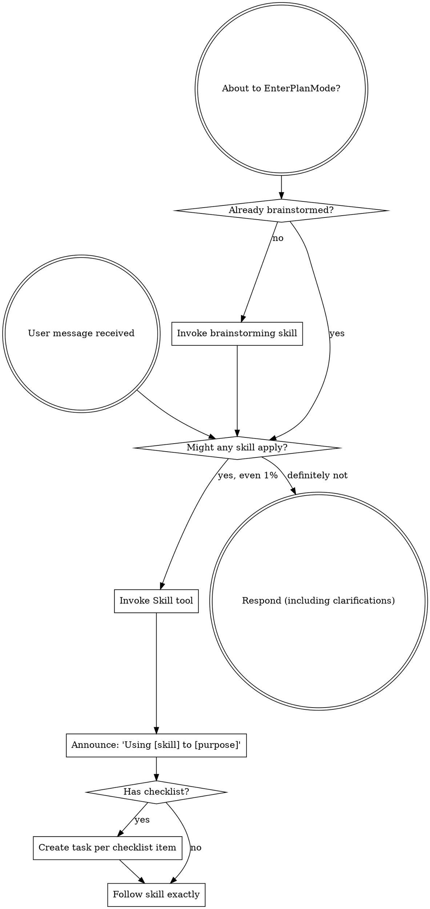

<SUBAGENT-STOP>
If you were dispatched as a subagent to execute a specific task, skip this skill.
</SUBAGENT-STOP>

<EXTREMELY-IMPORTANT>
If you think there is even a 1% chance a skill might apply to what you are doing, you ABSOLUTELY MUST invoke the skill.

IF A SKILL APPLIES TO YOUR TASK, YOU DO NOT HAVE A CHOICE. YOU MUST USE IT.

This is not negotiable. This is not optional. You cannot rationalize your way out of this.
</EXTREMELY-IMPORTANT>

## Instruction Priority

Razorback skills override default system prompt behavior, but **user instructions always take precedence**:

1. **User's explicit instructions** (AGENTS.md, CLAUDE.md, GEMINI.md, direct requests) - highest priority
2. **Razorback skills** - override default system behavior where they conflict
3. **Default system prompt** - lowest priority

If AGENTS.md, CLAUDE.md, GEMINI.md, or the user says "don't use TDD" and a skill says "always use TDD," follow the user's instructions. The user is in control.

## Project Policy Discovery

Before planning or dispatching subagents, use the active project instructions and
the approved plan as the policy source.

Razorback does not require a separate project-policy file or model table. Model
choice is left to the lead agent and harness defaults unless the user or
environment explicitly selects a model for the run.

## How to Access Skills

**In Claude Code:** Use the `Skill` tool. When you invoke a skill, its content is loaded and presented to you—follow it directly. Never use the Read tool on skill files.

**In Cursor:** Use the `Skill` tool. Skills auto-register via the razorback plugin, the same way they do in Claude Code.

**In Codex (CLI or desktop app):** Skills are discovered natively from `~/.agents/skills/`. When a skill applies, follow its SKILL.md content directly. No separate loading tool.

**In OpenCode:** Use the native `skill` tool. Skills auto-register via the razorback plugin.

**In Copilot CLI:** Use the `skill` tool. Skills are auto-discovered from installed plugins. The `skill` tool works the same as Claude Code's `Skill` tool.

**In Gemini CLI:** Skills activate via the `activate_skill` tool. Gemini loads skill metadata at session start and activates the full content on demand.

**In other environments:** Check your platform's documentation for how skills are loaded.

## Platform Adaptation

Skills use Claude Code tool names. On non-Claude-Code platforms, substitute the equivalent:

- **Codex:** see `references/codex-tools.md` (Task→spawn_agent, TodoWrite→update_plan, etc.)
- **Copilot CLI:** see `references/copilot-tools.md` (Read→view, Edit→edit, Task→task, etc.)
- **Gemini CLI:** see `references/gemini-tools.md` — loaded automatically via `GEMINI.md` (Read→read_file, Edit→replace, Task→`invoke_agent` with `generalist`, etc.)
- **OpenCode:** tool mapping is injected automatically by the razorback plugin bootstrap (Task→opencode's Task tool, TodoWrite→todowrite, etc.)

# Using Skills

## The Rule

**Invoke relevant or requested skills BEFORE any response or action.** Even a 1% chance a skill might apply means that you should invoke the skill to check. If an invoked skill turns out to be wrong for the situation, you don't need to use it.

## Red Flags

These thoughts mean STOP—you're rationalizing:

| Thought | Reality |
|---------|---------|
| "This is just a simple question" | Questions are tasks. Check for skills. |
| "I need more context first" | Skill check comes BEFORE clarifying questions. |
| "Let me explore the codebase first" | Skills tell you HOW to explore. Check first. |
| "I can check git/files quickly" | Files lack conversation context. Check for skills. |
| "Let me gather information first" | Skills tell you HOW to gather information. |
| "This doesn't need a formal skill" | If a skill exists, use it. |
| "I remember this skill" | Skills evolve. Read current version. |
| "This doesn't count as a task" | Action = task. Check for skills. |
| "The skill is overkill" | Simple things become complex. Use it. |
| "I'll just do this one thing first" | Check BEFORE doing anything. |
| "This feels productive" | Undisciplined action wastes time. Skills prevent this. |
| "I know what that means" | Knowing the concept ≠ using the skill. Invoke it. |

## Execution Model

When executing implementation plans:

- **2+ tasks (delegation available):** Use `razorback:subagent-driven-development` (fresh subagent per task — parallel batches when tasks are independent, serialized lanes when they are coupled; inline review by lead)
- **1 task, separate-session execution, or no delegation:** Use `razorback:executing-plans` (single agent, batch execution)
- **Ad-hoc parallel work (delegation available):** Use `razorback:dispatching-parallel-agents` (independent agent dispatch)
- **Small, local, reversible fix (quick-fix criteria):** Use `razorback:fixing-small-issues` — triage first, fix on the current checkout, verify the affected scope only. No worktree, no baseline suite run.

`subagent-driven-development` is the delegated execution path across Claude Code, Cursor, Codex, OpenCode, Copilot CLI, and Gemini CLI. If the current session cannot delegate (e.g., already running as a subagent — Gemini blocks recursion), fall back to `executing-plans`. The lead does inline review (spec compliance + code quality) either way.

## Skill Priority

When multiple skills could apply, use this order:

1. **Process skills first** (brainstorming, debugging) - these determine HOW to approach the task
2. **Domain skills second** - these guide execution

"Let's build X" → brainstorming first, then domain-specific skills.
"Fix this bug" → debugging first, then domain-specific skills.

## Skill Types

**Rigid** (TDD, debugging): Follow exactly. Don't adapt away discipline.

**Flexible** (patterns): Adapt principles to context.

The skill itself tells you which.

## User Instructions

Instructions say WHAT, not HOW. "Add X" or "Fix Y" doesn't mean skip workflows.

## Your Toolchain

Razorback skills assume **Miller MCP is available and MUST be used** for ALL codebase exploration — instead of Glob/Grep/Read chains.

Use Miller by capability, not by raw file reading:

| Capability — do this BEFORE the raw-file reflex | Miller tool |
|---|---|
| **Orient** — token-budgeted bundle for a task or area | `context(query)` |
| **Search** — find code by text, symbol, file/path, content, or concept | `search(query, mode=auto|text|symbol|file|content)` |
| **List a file's symbols** before reading the whole file | `inspect(path)` |
| **Inspect a symbol** (callers, callees, body) before modifying it | `inspect(symbol, depth=full)` |
| **Find references** before changing a public API | `trace(target)` |
| **Assess impact / blast radius** of a change | `impact(target)` |
| **Rename / edit** a symbol safely | `edit(operation, target)` |
| **Manage the workspace index** | `workspace(...)` |

**Rules (apply to the lead AND to every implementer, reviewer, and fix worker you dispatch):**
1. Use Miller for ALL codebase exploration. Do NOT fall back to Glob → Read → Grep chains.
2. List a file's symbols before reading it in full.
3. Inspect a symbol before modifying it.
4. Find a symbol's references before changing it, to check impact.
5. Do not infer or invent API shapes. Use Miller to discover symbol names, function signatures, config shapes, route names, CLI flags, or public contracts before relying on them.
6. When Miller cannot prove a shape, say what evidence is missing and choose the safest plan-consistent path. Do not fill gaps from memory or plausible guesses.
