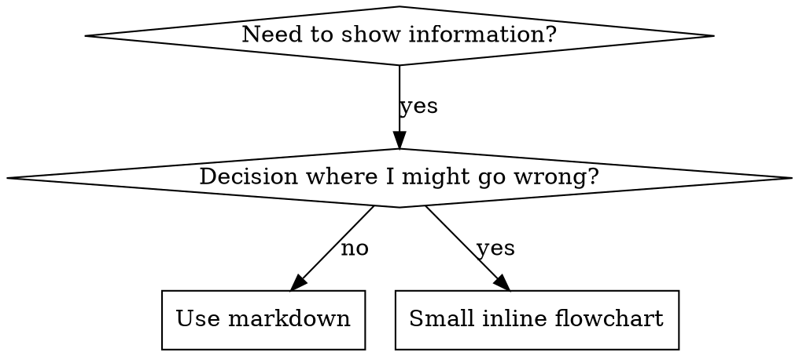

# Writing Skills

## Overview

**Writing skills IS Test-Driven Development applied to process documentation.**

You write test cases (pressure scenarios with subagents), watch them fail (baseline behavior), write the skill (documentation), watch tests pass (agents comply), and refactor (close loopholes).

**Core principle:** If you didn't watch an agent fail without the skill, you don't know if the skill teaches the right thing.

**REQUIRED BACKGROUND:** You MUST understand razorback:test-driven-development before using this skill. That skill defines the fundamental RED-GREEN-REFACTOR cycle.

**Personal skills** live in agent-specific directories: `~/.claude/skills` for Claude Code, `~/.agents/skills/` for Codex.

**Official guidance:** anthropic-best-practices.md in this directory carries Anthropic's official skill-authoring guidance, which complements the rules here.

## What is a Skill?

A **skill** is a reference guide for proven techniques, patterns, or tools. Skills help future Claude instances find and apply effective approaches.

**Skills are:** Reusable techniques, patterns, tools, reference guides

**Skills are NOT:** Narratives about how you solved a problem once. "In session 2025-10-03, we found empty projectDir caused..." is too specific to reuse.

## TDD Mapping for Skills

| TDD Concept | Skill Creation |
|-------------|----------------|
| **Test case** | Pressure scenario with subagent |
| **Production code** | Skill document (SKILL.md) |
| **Test fails (RED)** | Agent violates rule without skill (baseline) |
| **Test passes (GREEN)** | Agent complies with skill present |
| **Refactor** | Close loopholes while maintaining compliance |
| **Write test first** | Run baseline scenario BEFORE writing skill |
| **Watch it fail** | Document exact rationalizations agent uses |
| **Minimal code** | Write skill addressing those specific violations |
| **Watch it pass** | Verify agent now complies |
| **Refactor cycle** | Find new rationalizations → plug → re-verify |

## When to Create a Skill

**Create when:** the technique wasn't intuitively obvious to you, you'd reference it again across projects, it applies broadly (not project-specific), or others would benefit.

**Don't create for:**
- One-off solutions
- Standard practices well-documented elsewhere
- Project-specific conventions (put in CLAUDE.md)
- Mechanical constraints - if it's enforceable with regex/validation, automate it; save documentation for judgment calls

## File Organization

**Flat namespace** - all skills in one searchable namespace.

**Keep inline:** principles, concepts, code patterns (< 50 lines), everything else.

**Separate files only for:** heavy reference (100+ lines, e.g. API docs) and reusable tools (scripts, utilities, templates).

```
defense-in-depth/  SKILL.md                                  # Self-contained: all content fits inline
condition-based-waiting/  SKILL.md + example.ts              # Reusable tool: working helpers to adapt
pptx/  SKILL.md + pptxgenjs.md, ooxml.md, scripts/           # Heavy reference: 600-line API docs, XML structure
```

## SKILL.md Structure

**Frontmatter (YAML):** two required fields, `name` and `description` ([full spec](https://agentskills.io/specification)), 1024 chars max total.
- `name`: letters, numbers, and hyphens only - no parentheses or special chars
- `description`: triggering conditions only - see CSO below for the rule and the evidence behind it

**Body:**

```markdown
# Skill Name

## Overview            — what is this? Core principle in 1-2 sentences
## When to Use         — symptoms and use cases; when NOT to use; small inline flowchart IF the decision is non-obvious
## Core Pattern        — before/after comparison (techniques/patterns)
## Quick Reference     — table or bullets for scanning common operations
## Implementation      — inline code for simple patterns; link to a file for heavy reference or reusable tools
## Common Mistakes     — what goes wrong + fixes
## Real-World Impact   — concrete results (optional)
```

## Claude Search Optimization (CSO)

Future Claude finds your skill by matching the description, scanning the overview, then loading examples only when implementing. Put searchable terms early and often.

### 1. Rich Description Field

Claude reads the description to decide which skills to load. Make it answer: "Should I read this skill right now?"

**CRITICAL: Description = When to Use, NOT What the Skill Does**

The description describes ONLY triggering conditions. **NEVER summarize the skill's process or workflow.**

**Why this matters:** a description saying "code review between tasks" caused Claude to do ONE review, though the skill's flowchart clearly showed TWO (spec compliance, then code quality). Changed to just "Use when executing implementation plans with independent tasks" - no workflow summary - Claude read the flowchart and did both. A workflow summary creates a shortcut Claude takes, and the skill body becomes documentation Claude skips.

**Content:**
- Start with "Use when..." - concrete triggers, symptoms, situations that signal this skill applies
- Describe the *problem* (race conditions, inconsistent behavior), not *language-specific symptoms* (setTimeout, sleep)
- Keep triggers technology-agnostic unless the skill itself is technology-specific; if it is, make that explicit
- Write in third person (injected into system prompt)
- Keep under 500 characters if possible

```yaml
# ❌ Summarizes workflow - Claude follows this instead of reading the skill
description: Use when executing plans - dispatches subagent per task with code review between tasks
# ❌ Vague; first person; names a technology the skill isn't specific to
description: For async testing
description: I can help you with async tests when they're flaky
description: Use when tests use setTimeout/sleep and are flaky

# ✅ Triggering conditions only
description: Use when executing implementation plans with independent tasks in the current session
# ✅ Third person, describes the problem, technology-agnostic
description: Use when tests have race conditions, timing dependencies, or pass/fail inconsistently
# ✅ Technology-specific skill, explicit trigger
description: Use when using React Router and handling authentication redirects
```

### 2. Keyword Coverage

Use words Claude would search for:
- Error messages: "Hook timed out", "ENOTEMPTY", "race condition"
- Symptoms: "flaky", "hanging", "zombie", "pollution"
- Synonyms: "timeout/hang/freeze", "cleanup/teardown/afterEach"
- Tools: Actual commands, library names, file types

### 3. Descriptive Naming

**Name by what you DO or the core insight. Active voice, verb-first:**
- ✅ `creating-skills` not `skill-creation`; `using-skills` not `skill-usage`
- ✅ `condition-based-waiting` > `async-test-helpers`
- ✅ `flatten-with-flags` > `data-structure-refactoring`
- ✅ `root-cause-tracing` > `debugging-techniques`

**Gerunds (-ing) work well for processes** (`creating-skills`, `debugging-with-logs`) - they describe the action you're taking.

### 4. Token Efficiency (Critical)

**Problem:** getting-started and frequently-referenced skills load into EVERY conversation. Every token counts.

**Targets:** getting-started workflows <150 words each; frequently-loaded skills <200 words total; other skills <500 words.

**Techniques:**
- **Move details to tool help** - don't document every flag; say "Run `--help` for details"
- **Cross-reference instead of repeating** - "REQUIRED: Use [other-skill-name] for workflow" beats 20 lines of copied instructions
- **Compress examples** - cut dialogue to the shortest form that still shows the pattern; a 42-word exchange usually lands in 20
- **Eliminate redundancy** - don't repeat cross-referenced skills, don't explain what's obvious from the command, don't give two examples of one pattern

**Verify:** `wc -w skills/path/SKILL.md`

### 5. Cross-Referencing Other Skills

Use skill name only, with explicit requirement markers:
- ✅ `**REQUIRED SUB-SKILL:** Use razorback:test-driven-development`
- ✅ `**REQUIRED BACKGROUND:** You MUST understand razorback:systematic-debugging`
- ❌ `See skills/testing/test-driven-development` (unclear if required)
- ❌ `@skills/testing/test-driven-development/SKILL.md` - `@` force-loads files immediately, burning 200k+ context before you need them

## Flowchart Usage



**ONLY for:** non-obvious decision points, process loops where you might stop too early, "when to use A vs B" decisions.

**Never for:**
- Reference material → tables, lists
- Code examples → markdown blocks (flowchart code can't be copy-pasted and is hard to read)
- Linear instructions → numbered lists
- Labels without semantic meaning (step1, helper2, pattern4) → labels must carry meaning

See graphviz-conventions.dot for style rules; `render-graphs.js` renders a skill's flowcharts to SVG for your human partner (`--combine` for one file).

## Code Examples

**One excellent example beats many mediocre ones.** Choose the most relevant language: testing → TypeScript/JavaScript, system debugging → Shell/Python, data processing → Python.

**A good example** is complete and runnable, commented to explain WHY, drawn from a real scenario, and ready to adapt rather than a generic template.

**Don't** implement in 5+ languages (mediocre quality, maintenance burden), create fill-in-the-blank templates, or write contrived examples. You're good at porting - one great example is enough.

## The Iron Law (Same as TDD)

```
NO SKILL WITHOUT A FAILING TEST FIRST
```

This applies to NEW skills AND EDITS to existing skills.

Write skill before testing? Delete it. Start over.
Edit skill without testing? Same violation.

**No exceptions:**
- Not for "simple additions"
- Not for "just adding a section"
- Not for "documentation updates"
- Don't keep untested changes as "reference"
- Don't "adapt" while running tests
- Delete means delete

## Skill Types and How to Test Each

| Type | What it is | Test with | Passes when the agent |
|------|-----------|-----------|------------------|
| **Technique** | Concrete method with steps (condition-based-waiting, root-cause-tracing) | Application scenarios; edge-case variations; missing-information tests for gaps | applies it correctly to a new scenario |
| **Pattern** | Way of thinking about problems (flatten-with-flags, test-invariants) | Recognition scenarios; application scenarios; counter-examples (when NOT to apply) | identifies when and how to apply it |
| **Reference** | API docs, syntax guides, tool documentation | Retrieval scenarios; application scenarios; gap testing on common use cases | finds and correctly applies the information |
| **Discipline-enforcing** | Rules/requirements (TDD, verification-before-completion) | Academic questions; pressure scenarios; combined pressures (time + sunk cost + exhaustion); a counter for each rationalization found | follows the rule under maximum pressure |

## Common Rationalizations for Skipping Testing

| Excuse | Reality |
|--------|---------|
| "Skill is obviously clear" | Clear to you ≠ clear to other agents. Test it. |
| "It's just a reference" | References can have gaps, unclear sections. Test retrieval. |
| "Testing is overkill" | Untested skills have issues. Always. 15 min testing saves hours. |
| "I'll test if problems emerge" | Problems = agents can't use skill. Test BEFORE deploying. |
| "Too tedious to test" | Testing is less tedious than debugging bad skill in production. |
| "I'm confident it's good" | Overconfidence guarantees issues. Test anyway. |
| "Academic review is enough" | Reading ≠ using. Test application scenarios. |
| "No time to test" | Deploying untested skill wastes more time fixing it later. |

**All of these mean: Test before deploying. No exceptions.**

## Bulletproofing Skills Against Rationalization

Skills that enforce discipline (like TDD) need to resist rationalization. Agents are smart and will find loopholes under pressure. (Why these techniques work: persuasion-principles.md covers the research foundation — Cialdini, 2021; Meincke et al., 2025 — on authority, commitment, scarcity, social proof, and unity.)

**Close every loophole explicitly.** Don't just state the rule - forbid the specific workarounds. "Write code before test? Delete it." is weak alone. See this skill's Iron Law above for the strong form: it names each escape hatch (keeping it as "reference", "adapting" it, exempting "simple additions") and closes it.

**Address "spirit vs letter" arguments.** Add a foundational principle early - `**Violating the letter of the rules is violating the spirit of the rules.**` - to cut off that entire class of rationalization.

**Build a rationalization table.** Capture what your baseline (RED) run produced, verbatim. Every excuse goes in an `| Excuse | Reality |` table - see this skill's own table above for the format and bar.

**Update CSO for violation symptoms.** Put the symptoms of being ABOUT to violate the rule in the description: `description: use when implementing any feature or bugfix, before writing implementation code`

**Create a red flags list** so agents can self-check when rationalizing:

```markdown
## Red Flags - STOP and Start Over

- Code before test
- "I already manually tested it"
- "Tests after achieve the same purpose"
- "It's about spirit not ritual"
- "This is different because..."

**All of these mean: Delete code. Start over with TDD.**
```

## RED-GREEN-REFACTOR for Skills

**RED: Write the failing test (baseline).** Run the pressure scenario with a subagent WITHOUT the skill. Document what choices they made, what rationalizations they used (verbatim), and which pressures triggered violations. You must see what agents naturally do before writing the skill.

**GREEN: Write the minimal skill.** Address those specific rationalizations; add nothing for hypothetical cases. Re-run the same scenarios WITH the skill; the agent should now comply.

**REFACTOR: Close loopholes.** New rationalization? Add an explicit counter. Re-test until bulletproof.

**Testing methodology:** testing-skills-with-subagents.md covers writing pressure scenarios, pressure types (time, sunk cost, authority, exhaustion), plugging holes systematically, and meta-testing.

## STOP: Before Moving to Next Skill

**After writing ANY skill, you MUST STOP and complete the deployment process.**

**Do NOT:**
- Create multiple skills in batch without testing each
- Move to next skill before current one is verified
- Skip testing because "batching is more efficient"

**The deployment checklist below is MANDATORY for EACH skill.**

## Skill Creation Checklist (TDD Adapted)

**IMPORTANT: Use TaskCreate to create a task for EACH checklist item below.**

**RED Phase - Write Failing Test:**
- [ ] Create pressure scenarios (3+ combined pressures for discipline skills)
- [ ] Run scenarios WITHOUT skill - document baseline behavior verbatim
- [ ] Identify patterns in rationalizations/failures

**GREEN Phase - Write Minimal Skill:**
- [ ] Frontmatter valid: name is letters/numbers/hyphens only, max 1024 chars total
- [ ] Description follows the CSO rules (triggers only, "Use when...", third person, <500 chars)
- [ ] Keywords throughout for search (errors, symptoms, tools)
- [ ] Clear overview with core principle
- [ ] Address specific baseline failures identified in RED
- [ ] Code inline OR link to separate file
- [ ] One excellent example (not multi-language)
- [ ] Run scenarios WITH skill - verify agents now comply

**REFACTOR Phase - Close Loopholes:**
- [ ] Identify NEW rationalizations from testing
- [ ] Add explicit counters (if discipline skill)
- [ ] Build rationalization table from all test iterations
- [ ] Create red flags list
- [ ] Re-test until bulletproof

**Quality Checks:**
- [ ] Body follows the SKILL.md Structure template (quick reference table, common mistakes section)
- [ ] Small flowchart only if the decision is non-obvious
- [ ] No narrative storytelling
- [ ] Supporting files only for tools or heavy reference

**Deployment:**
- [ ] Commit skill to git and push to your fork (if configured)
- [ ] Consider contributing back via PR (if broadly useful)

## The Bottom Line

If you follow TDD for code, follow it for skills. It's the same discipline applied to documentation.
